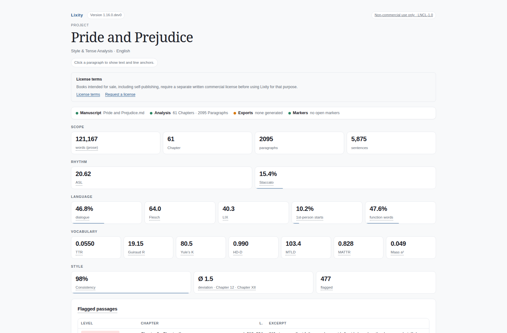
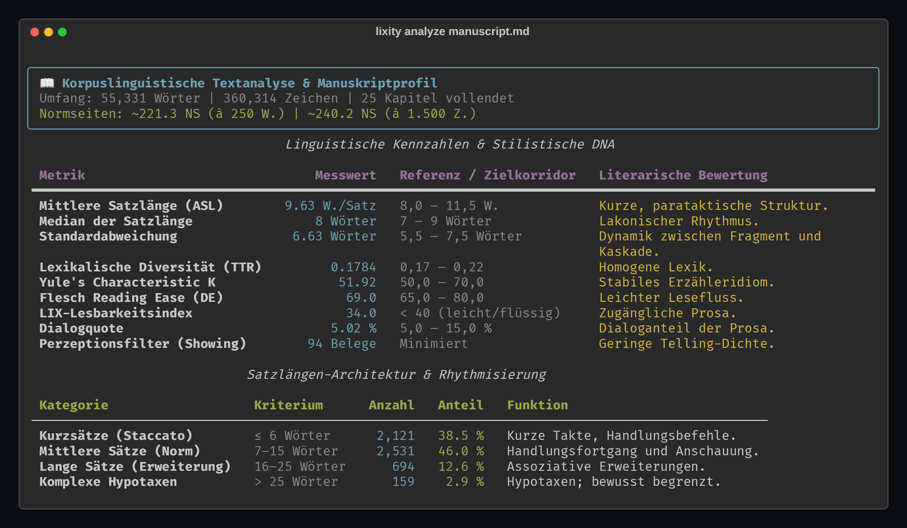
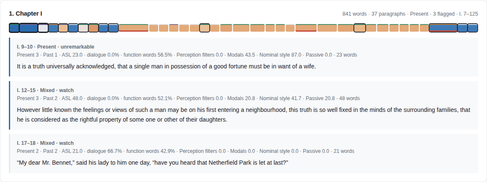
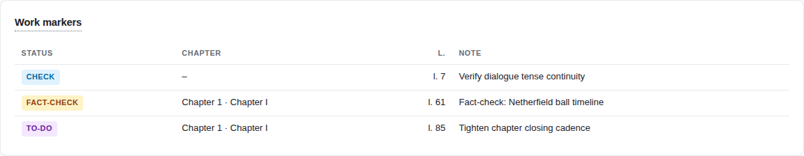

# Lixity

[](https://github.com/mfahsold/lixity/actions)


**Lixity** is an offline text-linguistics engine that measures *how a literary
manuscript reads* – sentence rhythm, lexical diversity, tense continuity,
register signals – and flags only the passages where a chapter departs from
the manuscript's own established voice.

Unlike grammar checkers or general NLP stacks, Lixity never measures against
external norms. It derives a **self-calibrating style reference** from the
manuscript itself (robust median/MAD house style), shrinks noisy observations
from short chapters ($z^*$), and controls false discoveries across all
chapter×feature cells (Benjamini-Hochberg FDR). The result is macro-editing
evidence, not style dogma.

Pure Python (3.10+), zero cloud calls, three dependencies (`pydantic`, `rich`,
`orjson`), seven native language profiles. Lixity is the analysis engine
behind a full-length novel project; the repository ships German and English
sample corpora for evaluation. The name stands for the mathematical
foundation of its analysis: **T**TR, **Y**ule's characteristic $K$, and
**LIX**.





## Key capabilities

- **Offline & deterministic:** identical input produces byte-identical
  metrics, JSON and HTML.
- **Self-calibrating norms:** no external style dogmas – the reference house
  style is derived from the manuscript's own median and MAD.
- **Statistical significance ($z^*$):** standard-error-aware deviation
  scoring (Poisson, binomial, Miller-Madow), so short chapters cannot trigger
  false alarms; plus Benjamini-Hochberg FDR control ($q = 0.05$).
- **Unsupervised style dimensions:** latent stylistic axes via Spearman rank
  correlation and cyclic Jacobi eigendecomposition (standard library only).
- **Paragraph-accurate tense profiling:** narrative present vs. epic past per
  paragraph, with line anchors and friction severity.
- **Editor-visible work markers:** invisible HTML comments with deterministic
  content-hash IDs and free-text notes, writable from the dashboard or API.
- **Idempotent workspace build:** `lixity build` publishes a reproducible
  artifact set; unchanged input causes zero writes.
- **Coherent dashboard:** optional component status strip, clickable KPIs
  that drill down and preselect the matching filter, style-reference band
  chart, deviation layer.
- **Agent-ready:** strict JSON schemas with meta blocks, clean exit codes, a
  stable `lixity.api` facade, and an agent guide in
  [`docs/AGENTS.md`](docs/AGENTS.md).

## Installation

```bash
pip install git+https://github.com/mfahsold/lixity.git

# local development
git clone https://github.com/mfahsold/lixity.git && cd lixity
pip install -e .
```

## Quick start

```bash
lixity analyze manuscript.md            # Rich terminal report (--json for machines)
lixity profile manuscript.md            # tense continuity, paragraph by paragraph
lixity style manuscript.md              # self-calibrating style reference (--json: schema v2)
lixity dashboard manuscript.md -o exports/dashboard.html
cd my-novel && lixity build             # idempotent workspace: exports/ + archive
lixity about                            # languages, features, heuristics
```

Try it on the bundled public-domain samples:

```bash
lixity analyze samples/effi-briest.md          # German – Fontane, 36 chapters
lixity analyze samples/pride-and-prejudice.md  # English – Austen, 61 chapters
```

Full command reference, metric glossary, worked example and troubleshooting:
[`docs/USAGE.md`](docs/USAGE.md).



## What Lixity measures

Five groups of features, all documented with their formulas and caveats in
[`docs/USAGE.md`](docs/USAGE.md#understanding-the-metrics):

1. **Sentence architecture & rhythm** – average sentence length, staccato /
   paratactic / hypotactic distribution, coefficient of variation,
   punctuation.
2. **Lexical diversity** – TTR, Guiraud's $R$, HD-D (McCarthy & Jarvis),
   MTLD, MATTR, Maas a², Yule's characteristic $K$ – with length guards for
   short texts.
3. **Readability** – language-calibrated Flesch family (Amstad, Flesch,
   Kandel-Moles, Szigriszt-Pazos, Franchina-Vacca, Martins, Douma) and LIX.
4. **Narrative voice & register** – dialogue share, function words,
   perception filters, modals, passive, nominalisations, adjectives,
   sentence-starter entropy, first-person starts.
5. **Tense dynamics** – per-paragraph dominance (present / past / mixed /
   neutral) and friction severity 0–3.

## How the style reference works

1. **Robust centrality:** 16 features per chapter, median and MAD (scaled
   $\sigma \approx 1.4826 \times \text{MAD}$).
2. **Significance-adjusted $z^*$:**
   $$z^* = \frac{x - \text{median}}{\sqrt{\sigma_{\text{MAD}}^2 + \text{SE}^2}}$$
   A short chapter must deviate dramatically to be flagged.
3. **FDR control:** in a 400-cell matrix (25 chapters × 16 features), ~5 cells
   at $|z^*| \ge 2.5$ are expected by chance; the Benjamini-Hochberg set
   ($q = 0.05$) separates real shifts from noise.
4. **Style dimensions:** principal axes of the Spearman correlation matrix
   (cyclic Jacobi eigendecomposition, pure standard library) – the author's
   own latent axes, not preconceived genre models.

Implementation notes and the full stability register (research basis, known
limitations, every documented trade-off): [`docs/STABILITY.md`](docs/STABILITY.md).

## Work markers (editor-visible)

Markers are HTML comment lines placed directly above the target paragraph:

```markdown
<!-- LIXITY-MARKER id="m-7f8a1c9b" kind="pruefen" note="Tempusprüfung" created="…" -->
Er ging zum Fenster und sieht den Regen fallen.
```

- Visible in VS Code, Obsidian, Neovim, Ulysses; **invisible in every export**
  (Pandoc, Typst, LaTeX treat HTML comments as comments).
- Deterministic content-hash IDs stay anchored when surrounding text changes.
- Clicking a marker kind in the control dashboard opens an inline note field
  (`Enter` saves, `Esc` cancels).
- Programmatic access: `api.markers`, `api.add_marker`, `api.resolve_marker`.



## Python API for AI agents

```python
from lixity import api

metrics = api.analyze(text, language="auto")          # {"meta", "metrics"}
profiles = api.profile(text, language="de")           # {"meta", "chapters", "paragraphs"}
reference = api.fingerprint(text, language="de")      # style reference (schema v2)
html = api.dashboard(text, language="de", title="My Manuscript")
new_text, marker = api.add_marker(text, kind="pruefen", note="Verify tense", line=142)
updated_text, ok = api.resolve_marker(new_text, marker["id"])
info = api.about()                                    # languages, features, heuristics
```

Machine-readable surfaces:

| Need | Surface |
| :--- | :--- |
| Corpus metrics | `lixity analyze FILE --json` (schema v1, meta block) |
| Paragraph profiles | `lixity profile FILE` |
| Style reference (bands, z\*, FDR, dimensions) | `lixity style FILE --json` (schema v2) |
| Reproducible artifact set | `lixity build [FILE] [--dry-run]` |
| Capability discovery | `lixity about --json` |
| LLM-friendly site summary | [`docs/llms.txt`](docs/llms.txt) |

Contracts, interpretation heuristics and dashboard DOM hooks:
[`docs/AGENTS.md`](docs/AGENTS.md). Known limitations:
[`docs/STABILITY.md`](docs/STABILITY.md).

## Languages

| Code | Language | Tense detection | Readability |
| :---: | :--- | :--- | :--- |
| `de` | German | Präsens / Präteritum | Flesch (Amstad) + LIX |
| `en` | English | Present / Past | Flesch + LIX |
| `fr` | French | Présent / Imparfait / Passé | Flesch (Kandel-Moles) + LIX |
| `es` | Spanish | Presente / Pasado | Flesch (Szigriszt-Pazos) + LIX |
| `it` | Italian | Presente / Passato | Flesch (Franchina-Vacca) + LIX |
| `pt` | Portuguese | Presente / Pretérito | Flesch (Martins) + LIX |
| `nl` | Dutch | O.T.T. / O.V.T. | Flesch (Douma) + LIX |
| `generic` | Fallback | minimal | LIX |

`--language auto` detects via function-word distribution. Adding a language is
one `LanguageProfile` entry – no algorithmic change.

## Implementation principles

- **HD-D:** McCarthy & Jarvis (2010) closed-form hypergeometric vocd, 42
  deterministic samples of 35 tokens.
- **Yule's $K$:** $K = 10^4 \cdot \frac{\sum_m m^2 V_m - N}{N^2}$.
- **Miller-Madow correction:** $H_{\text{corr}} = -\sum p_i \ln p_i + \frac{k-1}{2N}$
  for sentence-starter entropy.
- **Cyclic Jacobi eigendecomposition:** solves $Av = \lambda v$ via plane
  rotations – orthogonal eigenvectors without BLAS/LAPACK.

## FAQ

<details>
<summary><b>Why not compare against an external corpus?</b></summary>
A literary manuscript has its own aesthetic. Measuring it against "average
newspaper German" produces meaningless critique; Lixity discovers what is
normal <i>for this book</i>.
</details>

<details>
<summary><b>Does it work for non-fiction?</b></summary>
Yes – rhythm, lexical richness, readability and the style reference apply to
essays, dissertations, memoirs and documentation as well.
</details>

<details>
<summary><b>Can it run in CI pipelines?</b></summary>
Yes: offline, deterministic, POSIX exit codes (0 / 1 / 2), byte-identical JSON
for identical input.
</details>

## License & attribution

**Lixity Non-Commercial License 1.0 (LNCL-1.0)** – *source-available, not open
source*: free for research, education, personal writing and clearly
non-commercial open science. Commercial use requires a written license
(mfahsold@googlemail.com). Full terms: [`LICENSE`](LICENSE); the license text
must be kept with every copy.

Third-party components (all permissive): [pydantic](https://github.com/pydantic/pydantic)
(MIT), [rich](https://github.com/Textualize/rich) (MIT),
[orjson](https://github.com/ijl/orjson) (MIT/Apache-2.0).

Sample corpus: `samples/` ships two **public-domain** works for testing and
demos — Fontane's *Effi Briest* (German, [Project Gutenberg #5323](https://www.gutenberg.org/ebooks/5323))
and Austen's *Pride and Prejudice* (English, [#1342](https://www.gutenberg.org/ebooks/1342)) —
each as an unmodified Project Gutenberg source file plus a Markdown
conversion. They are **not** relicensed by the LNCL; the original sequel
draft in `samples/effi-briest-folge/` is the author's own work. Provenance and
license details: [`samples/README.md`](samples/README.md).

Contact: **Matthias Fahsold** ([mfahsold@googlemail.com](mailto:mfahsold@googlemail.com))
