# Lixity

[](https://github.com/mfahsold/lixity/actions)


**Explore sentence rhythm, vocabulary and tense across your manuscript.**
Lixity turns Markdown into an offline, interactive dashboard. Compare chapters
against the manuscript's own style, then inspect the passages behind each signal.

Python 3.10+ · Seven language profiles · No cloud calls.

The experimental local research workspace is included in `v1.16.0`.

**Free only for non-commercial projects.** Using Lixity for a book intended
for sale—including self-publishing—requires a separate written commercial
license. [Examples and terms](docs/LICENSING.md).


```bash
lixity build manuscript.md --language en
```

Open `exports/manuscript_dashboard.html`.
[Onboarding Guide](docs/ONBOARDING.md) · [Install Lixity](#installation) · [Usage](docs/USAGE.md) · [Methods](docs/METHODS.md)

## Analysis and research capabilities

Lixity combines text analysis and dashboard presentation. The optional local
research archive is a separate, explicit-project experimental API.

| Pillar | Scope | Core Techniques & Features |
| :--- | :--- | :--- |
| **01. Stylistics & Corpus Diagnostics** | Macro & micro sentence architecture | ASL, rhythm CV, 4 length tiers (staccato to hypotaxis), language-specific readability formula variants, and lexical diversity measures (HD-D, MTLD, Yule's K, Maas a²). |
| **02. Dramaturgy & Tense Profiling** | Paragraph-accurate narrative continuity | Tense classification (present, past, mixed, neutral), 4-tier friction severity rating (0–3), speech ratios, dialogue turns, scene pacing curves, and chapter tension hooks. |
| **03. Robust 3D Style Space** | Self-calibrating manuscript baseline | Manuscript-intrinsic median ± 2 MAD corridor, noise-aware z\* shrinkage, Benjamini–Hochberg / BY FDR multiplicity control, cyclic Jacobi EVD, and interactive 3D trajectory. |
| **04. Typographic Publication** | Print & digital publishing vectors | Cairo & Pango PDF engine with subpixel metrics, font hinting control, collision-free tracking: Paperback (135×205 mm), Editorial Proof A4 with line numbers, Mobile 9:16 PDF, and valid EPUB 3.3 with dual NCX/nav navigation. |
| **05. Research pilot (experimental)** | Local source archive and passage citations | Immutable SHA-256 UTF-8 storage, source criticism, SQLite FTS5 search, manual claims, evidence links, author decisions, and cross-corpus comparison. |

## Mathematical Core

| Estimator / Method | Role in System |
| :--- | :--- |
| Robust baseline x̃, MAD, σ = 1.4826 · MAD | Manuscript-intrinsic house-style corridor per feature |
| Noise-aware z\* = (x − x̃) / √(σ² + SE²) | Shrinks sampling noise in short chapters via analytical SE |
| BH / BY FDR at q (default: 0.05) | Multiplicity-controlled `fdr_flagged` cells |
| Expected FP = m · P(\|Z\| ≥ z_mild) | Calibration against statistical over-interpretation |
| Cliff’s δ / Vargha–Delaney Â₁₂ | Standardized non-parametric effect size for confirmed cells |
| Runs test + Lag-1 ρ₁ | Exchangeability diagnostics (I.I.D. baseline assumption) |
| Spearman ρ + cyclic Jacobi EVD | Latent style dimensions and principal axes (pure stdlib) |
| PELT changepoints (BIC) | Locates structural regime shifts in the house style |
| Mann–Kendall τ, S, p | Detects monotonic feature drift across chapter progression |
| Sn / Qn (Rousseeuw & Croux) | Outlier-resistant alternative scale cross-checks to MAD |
| Hill tail index (α̂) | Diagnostics for heavy-tailed feature distributions |
| 1D Wasserstein + 2-sample KS | Distributional shift between early and late manuscript halves |
| Dunning G² + Co-occurrence fitness | Lexical keyness and Goh–Barabási network architecture |

Thresholds (`z_mild`, `z_strong`, `fdr_q`, `fdr_method`, `dim_score_threshold`, `flag_min_severity`) are fully configurable via CLI flags, API kwargs, UI settings, or `[tool.lixity]` project configuration (resolution order in [`docs/METHODS.md`](docs/METHODS.md)).

## Key Capabilities

- **Offline & Deterministic:** Identical input produces bit-identical metrics, JSON, and HTML reports.
- **Self-Calibrating Norms:** House style derived from the manuscript's own median and MAD bands.
- **Noise-Aware z\* + FDR (BH/BY):** Configurable significance procedure with assumptions and diagnostic limits.
- **Effect Sizes & Diagnostics:** Cliff’s δ, Runs test, and lag-1 autocorrelation for every confirmed cell.
- **Structural Diagnostics:** PELT changepoints, Mann–Kendall trends, Sn/Qn scales, Hill tail index, Wasserstein–KS shift, Goh–Barabási co-occurrence graphs, and Dunning G² keyness.
- **Latent Style Dimensions:** Spearman rank correlation and cyclic Jacobi eigendecomposition (pure Python stdlib).
- **Paragraph-Accurate Tense Profiling:** Present, past, mixed, neutral with a 0–3 friction severity scale.
- **Narratological Structure Modules:** Dialogue turn structure, character presence, scene/pacing curves, motifs, and showing vs. telling balance.
- **Idempotent Workspace Build & Dashboard:** Fully self-contained, single-file interactive HTML dashboard with 7 language profiles.
- **AI Agent-Ready:** Strict JSON schemas (analyze/profile **v2**, style **v4**), stable `lixity.api` facade, [`docs/AGENTS.md`](docs/AGENTS.md).

## Visual Analytical Suite

### 1. Modern Workspace Management & SOTA Project Creation

| Welcome & Quickstart Hero | Project Creation Wizard & Template Cards |
| :---: | :---: |
| 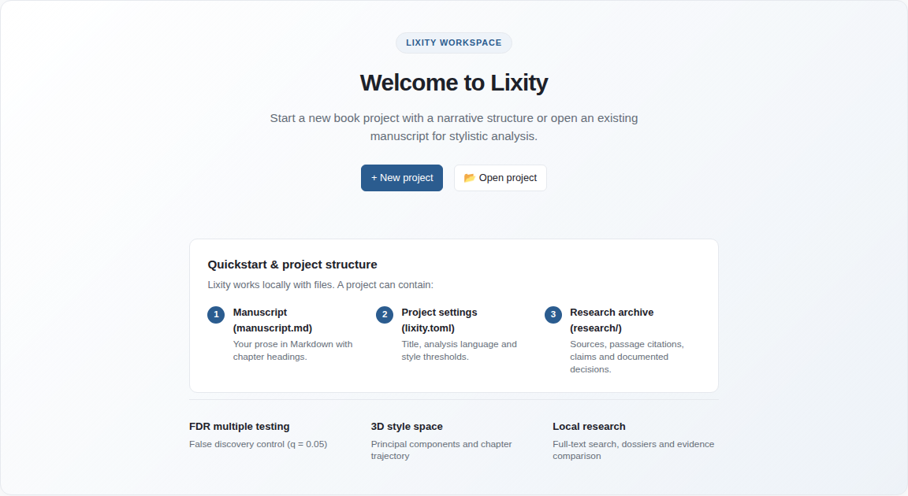 | 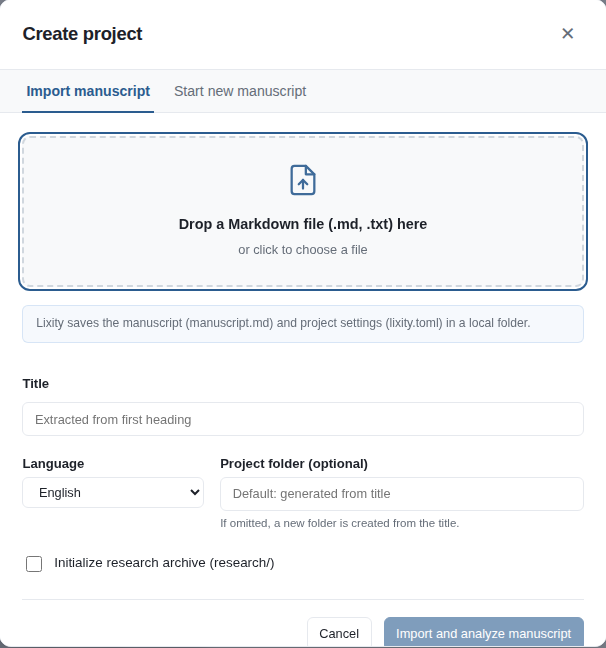 |
| *Streamlined workspace initialization in empty/no-project state* | *Native `<dialog>` wizard with Minimal, 3-Act & Research novel templates* |

### 2. Macro Departure Heatmap (Noise-Aware z* & FDR)

<p align="center">
  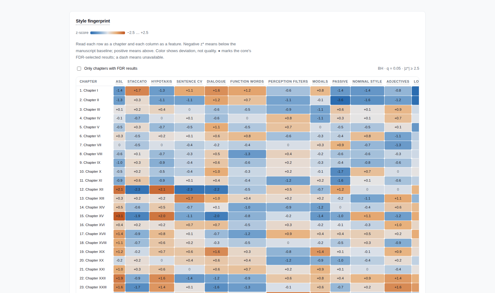
</p>

*Departures from the manuscript's own style across 16 linguistic features. Dots (●) mark cells passing the configured Benjamini–Hochberg / Benjamini–Yekutieli FDR procedure. These are review signals under model assumptions, not confirmed defects.*

### 3. Paragraph Inspection & Editorial Work Markers

| Paragraph Style Layer Overlay | Editor-Visible Work Markers |
| :---: | :---: |
|  |  |
| *Sentence rhythm & syntactic density mapped in context* | *Persistent content-hashed `<!-- LIXITY-MARKER -->` tags* |

### 4. Latent Style Space & House Style Baseline

| 3D Stylistic Space & Style Dimensions | Manuscript Style Reference Bands |
| :---: | :---: |
| 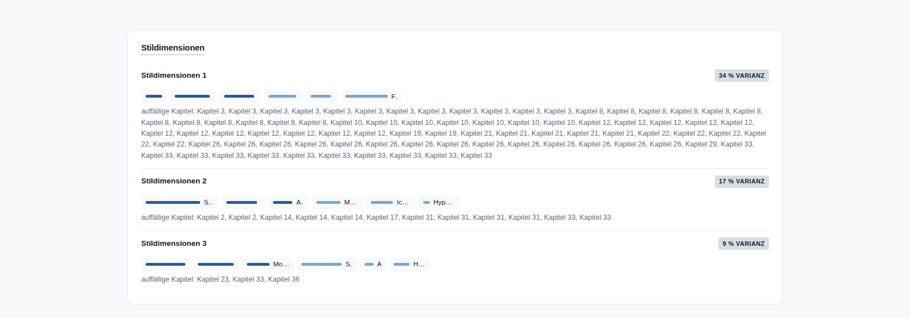 | 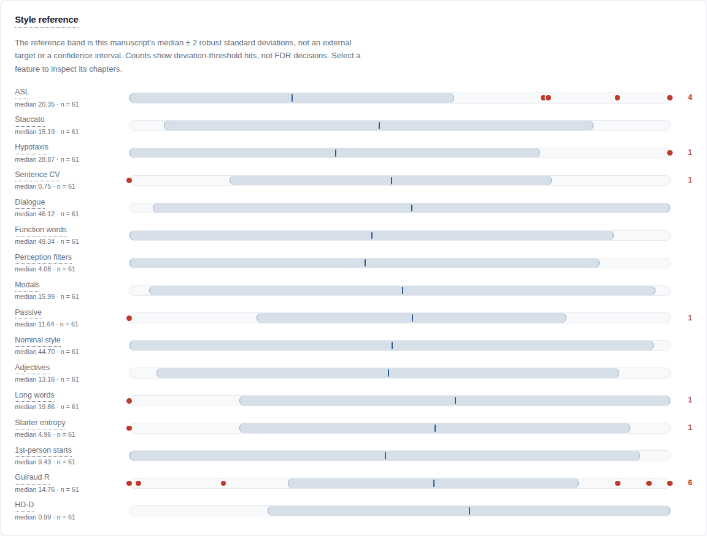 |
| *Interactive 3D narrative trajectory & cyclic Jacobi EVD* | *Robust Median/MAD bands with chapter sample counts* |

### 5. Terminal Suite & Deterministic CLI

| CLI Corpus Diagnostics (`lixity analyze`) | Self-Calibrating Style Reference (`lixity style`) |
| :---: | :---: |
|  | 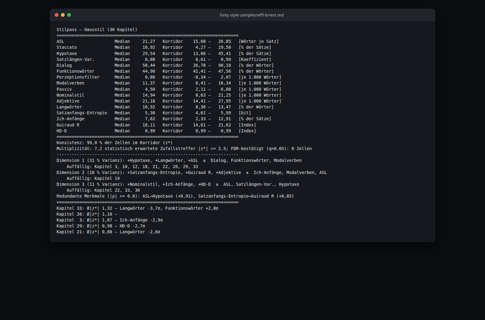 |
| *Corpus KPIs, readability indices & sentence rhythm* | *Shrinkage corridor, structural changepoints & drift* |

<details>
<summary><b>View Dashboard in Dark Mode &amp; Interactive Settings</b></summary>
<br/>

<p align="center">
  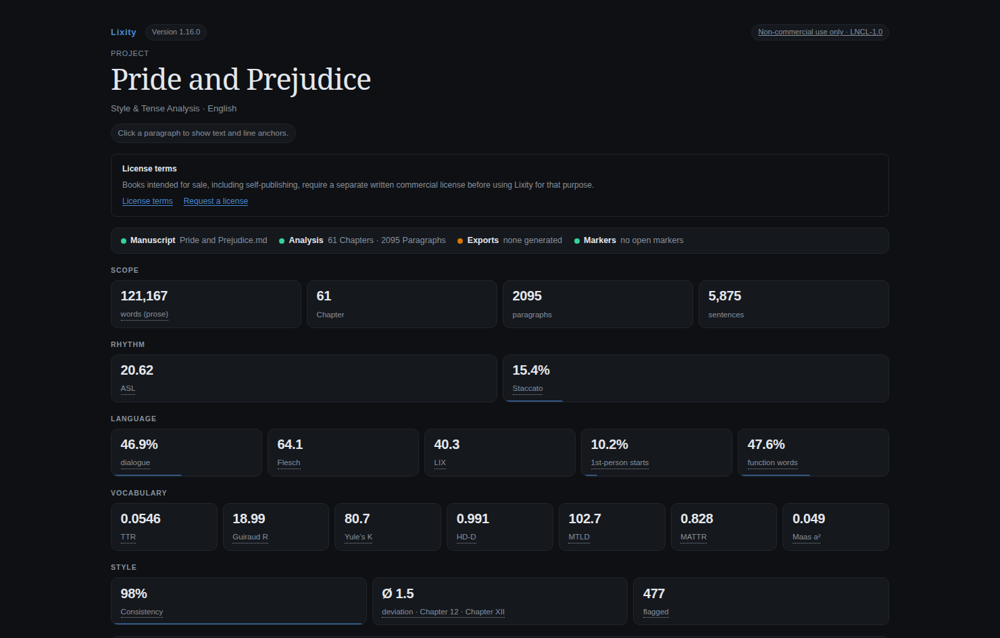
</p>

<p align="center">
  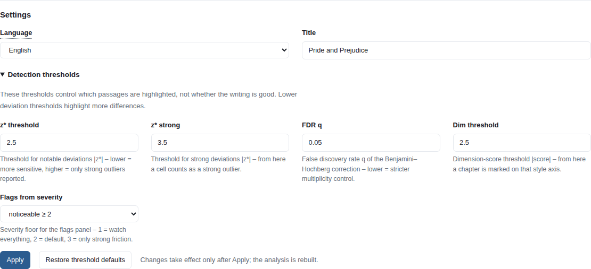
</p>

</details>

### 6. Research Workspace & Archival Citations (Pilot)

| Archived Source Dashboard (`lixity research dashboard`) | CLI Full-Text Search & Exact Citation (`lixity research search/cite`) |
| :---: | :---: |
| 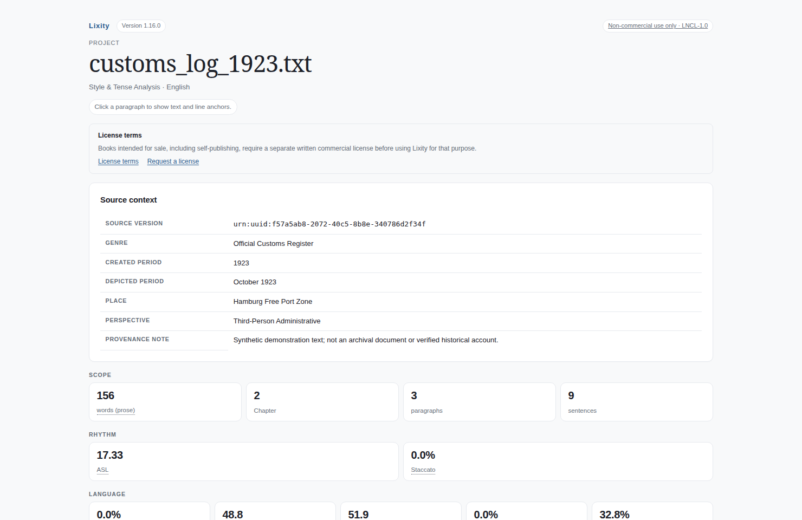 | 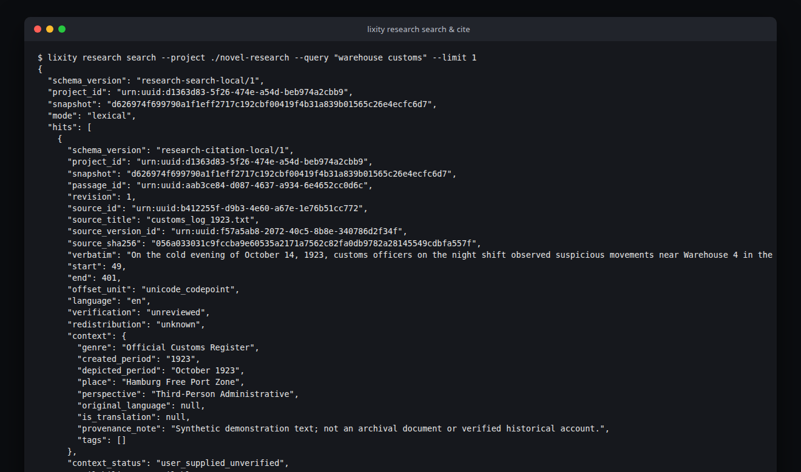 |
| *User-supplied source context (genre, period, place, provenance) & stylometrics* | *SQLite FTS5 BM25 search & Unicode codepoint character offsets* |

The [interactive research panel](docs/screenshots/dashboard-research-claims.png)
provides full source and dossier details, manually recorded claims, and evidence
links. Search results can feed **Use for claim** or **Use for dossier**; a claim
can be associated with a dossier. [View decisions](docs/screenshots/dashboard-research-decisions.png)
or the [claims](docs/screenshots/dashboard-research-claims-mobile.png) and
[decisions](docs/screenshots/dashboard-research-decisions-mobile.png) mobile views.

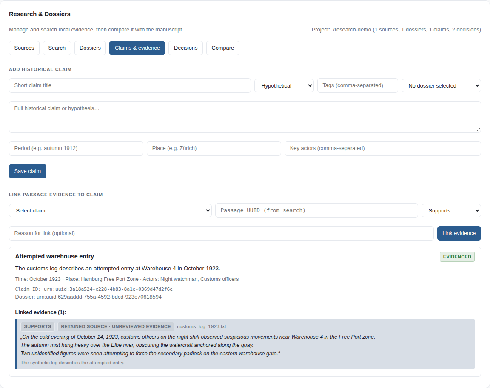

### 7. Responsive Mobile Views

| Project overview | Complete style-dimension panel |
| :---: | :---: |
| 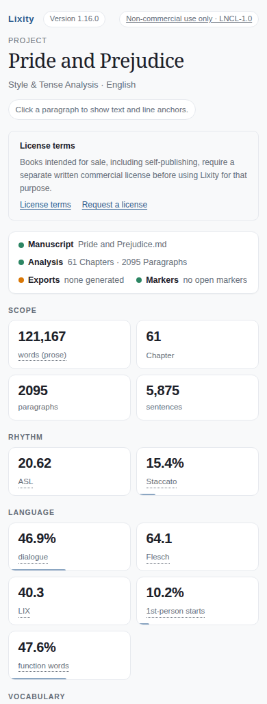 | 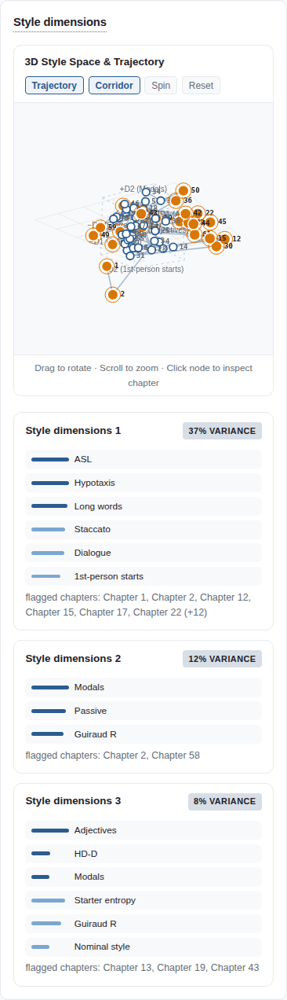 |

Analysis screenshots use the public-domain *Pride and Prejudice* sample;
research panel screenshots use synthetic archive records. Marker notes are
illustrative and never written back to the source. Open an image for full
resolution. [Screenshot provenance and regeneration](docs/screenshots/README.md).

## Installation

Install from GitHub into an isolated CLI environment. Requires Git and
[uv](https://docs.astral.sh/uv/getting-started/installation/); uv can supply
Python 3.12. Source-available under LNCL-1.0, **non-commercial use only**, not PyPI.

```bash
uv tool install --python 3.12 "git+https://github.com/mfahsold/lixity.git@v1.16.0"
lixity --version
lixity about
```

This installs **v1.16.0**, including the experimental local research pilot.
The tag stays pinned: upgrading to a future release requires selecting
its tag explicitly. Use `@main` only for development builds, or a reviewed
full commit hash for reproducible deployments.

**[Full installation guide](docs/INSTALLATION.md):** Windows/macOS/Linux,
pipx alternative, Python API environments, PATH repair, upgrades and removal.
Python 3.10+ supports the engine and TOML project settings; Python 3.10 uses
the conditional `tomli` dependency.

For engine development:

```bash
git clone https://github.com/mfahsold/lixity.git && cd lixity
make install-dev        # venv + pip install -e ".[dev]"
make check              # ruff + mypy --strict + pytest -W error

```

`make install` creates a local `.venv` without dev tools; both installation
targets verify dependencies and version, without changing global Python.

## Quick Start

Start with a UTF-8 Markdown manuscript using `## Chapter title` headings:

```bash
lixity build manuscript.md --language en
```

Open `exports/manuscript_dashboard.html`. Use `--language de` for German or
explicit `--language auto` for detection. No account, API key or upload is needed.
Settings/NDA actions require a project adapter, not just the standalone HTML.

Other commands:

```bash
lixity serve --no-project --port 8765        # Native dev server & onboarding wizard
lixity analyze manuscript.md                 # Rich terminal report (--json for machines)
lixity profile manuscript.md                 # Tense continuity, paragraph by paragraph
lixity style manuscript.md                   # Style reference (BH/BY, δ, diagnostics)
lixity dialogue manuscript.md                # Turn structure and speech ratio per chapter
lixity characters manuscript.md --names "Anna,Ralf" # Character presence
lixity pacing manuscript.md                  # Scenes, tempo, and chapter hooks
lixity motifs manuscript.md --motif 'Wut=\b(Wut|wütend\w*)\b' # Motifs & repetition
lixity showing manuscript.md                 # Showing vs. telling per chapter
lixity dashboard manuscript.md -o exports/dashboard.html # Interactive HTML dashboard
lixity research --help                       # Evidence archive, claims & decisions
cd my-novel && lixity build                  # Idempotent workspace: exports/ + archive
lixity about                                 # Languages, heuristics, and metadata
```

Common sensitivity flags (for `style`, `dashboard`, and `build`):

```bash
lixity style manuscript.md --json \
  --z-mild 2.5 --z-strong 3.5 --fdr-q 0.05 --fdr-method bh \
  --dim-threshold 2.5 --flag-min-severity 2
```

Project-wide defaults: place the same keys under `[tool.lixity]` in
`pyproject.toml`, or in `lixity.toml` / `~/.config/lixity.toml`
(CLI flag > UI session > project config > user config > code defaults).

Use `--min-chapters 4` with `style`, `dashboard` or `build` to require at least
four usable chapters for a style baseline (default: 2). API callers can pass
`min_chapters=4, project_config={}` to `fingerprint`/`passport` or `dashboard`
to avoid implicit threshold lookup. Language remains an explicit argument.

Test with the bundled public-domain samples:

```bash
lixity analyze samples/effi-briest.md --language de  # German – Fontane, 36 chapters
lixity analyze samples/pride-and-prejudice.md  # English – Austen, 61 chapters
```

Reports and CLI messages appear in English by default; `LIXITY_LANG=de` switches them to German.

Full command reference, metric glossary, worked example, and troubleshooting:
[`docs/USAGE.md`](docs/USAGE.md). Agent-facing JSON contracts:
[`docs/AGENTS.md`](docs/AGENTS.md). Project website:
[mfahsold.github.io/lixity](https://mfahsold.github.io/lixity/).

## What's new in v1.16.0

**v1.16.0** adds the experimental local research workspace and completes the
research-panel workflow. Read the [release notes](docs/releases/v1.16.0.md)
for scope, compatibility, and limits.

- **Local research archive:** explicitly select a project, retain permitted
  UTF-8 source bytes, verify exact passage citations, and search a disposable
  SQLite FTS5 index. Research remains an experimental API, separate from analysis.
- **Connected author workflow:** inspect source and dossier details in the
  server UI, select passages directly from search for claims or dossiers,
  associate claims with dossiers, and record decisions without certifying facts.
- **Evidence lifecycle:** withdrawal removes a source from active search;
  purge deletes unshared retained bytes while linked authored records show
  unavailable citations without deleted quotations.
- **Consistent boundaries:** opening an existing project restores its archive
  and project settings. The seven-language interface is available throughout
  the workspace; English and German still have the deepest linguistic cores.

The engine produces offline analysis and HTML, and `lixity serve` provides a
local project and experimental research workspace. Publication workflows and
encrypted NDA storage belong to project adapters; Lixity is not a hosted service.

## Architecture and project adapters

The experimental [local research workspace](docs/research/USAGE.md) in `v1.16.0` archives UTF-8 sources,
attaches versioned source criticism context and tags, resolves exact citations, connects to the
analysis pipeline, manages dossiers with cited evidence, provides an interactive web
management UI in `lixity serve`, supports controlled withdrawal and purge, and compares
vocabulary grounding against literary manuscripts. OCR pipelines and hybrid vector search remain in the
[target architecture](docs/research/README.md).

CLI commands and the Python API share `lixity.pipeline`: language resolution,
paragraph profiling and fingerprint construction have one implementation.
`analyze_document` computes corpus metrics once and returns a typed
`DocumentAnalysis`; renderers only consume results. UI panels reuse central
components and bundled assets, without a frontend build or CDN.

Project adapters own file access, publication exports and local services—not
copies of analysis algorithms. For multiple projects in one process, pass an
explicit configuration instead of changing the working directory:

```python
from lixity.config import load_project_config, resolve_thresholds
from lixity.pipeline import analyze_document, resolve_document_config

settings = load_project_config("/path/to/project")
thresholds = resolve_thresholds(project_config=settings)
config, language = resolve_document_config(text, settings.get("language", "en"))
result = analyze_document(text, config, thresholds)
```

An empty `project_config={}` isolates thresholds from user/project files;
explicit threshold arguments override the supplied mapping. The pipeline itself
does not read files, discover projects or maintain global session state.

Adapters using the shared pipeline require Lixity 1.15.0 or newer.
See [architecture and integration boundaries](docs/ARCHITECTURE.md) for the
configuration contract and [language support](docs/LOCALIZATION.md) for its
scope, guarantees and limitations.

## What Lixity Measures

Detailed formulas, mathematical derivations, and academic citations are documented in [`docs/METHODS.md`](docs/METHODS.md) and [`docs/USAGE.md`](docs/USAGE.md#understanding-the-metrics):

1. **Sentence Architecture & Rhythm** – Average sentence length (ASL), coefficient of variation (CV), and distribution across four syntactic length tiers (staccato ≤ 6 words, medium 7–15, long 16–25, complex hypotaxis > 25 words). Uncovers pacing ruptures, breathlessness, and rhythmic monotony.
2. **Lexical Diversity with Length Guards** – Type-Token Ratio (TTR), Guiraud R, hypergeometric HD-D (McCarthy & Jarvis 2010), MTLD, moving-average MATTR, Maas a², and Yule's characteristic K. Minimum token counts reduce unstable short-text results; none makes chapters of different lengths perfectly comparable.
3. **Language-Specific Readability Formulas** – Standard LIX (Björnsson, words > 6 characters for all languages) and language-specific Flesch variants: Amstad (de), classic Flesch (en), Kandel-Moles (fr), Szigriszt-Pazos (es), Franchina-Vacca (it), Martins (pt), and Douma (nl). These formula outputs are not a measure of literary quality.
4. **Narrative Voice & Register** – Dialogue ratio, function-word density (the author's implicit grammatical fingerprint), perception filters ("telling" verbs like *saw*, *heard*, *felt*), modal hedging, passive voice, nominal style suffixes, sentence-starter Shannon entropy, and first-person openings.
5. **Tense Dynamics & Continuity** – Paragraph-accurate classification into dominant tense (present, past, mixed, neutral) with a 4-tier friction severity rating (0–3) to flag unintended slips between epic past and scenic present.

## Editorial Practice: The Macro-Editing Matrix

Statistical indicators are not an objective quality score or an instruction to rewrite prose. The questions below are possible readings of a signal, not diagnoses or required interventions:

| Linguistic Feature | Calculation & Diagnostic Signal | Editorial Interpretation & Practical Editing | Warning Signal & Editorial Intervention |
| :--- | :--- | :--- | :--- |
| **Sentence Rhythm & Length Tiers** | ASL, rhythm CV, staccato (≤6w), hypotaxis (>25w) | **Pacing:** Variation in sentence length can draw attention to shifts between action, dialogue, and reflection. | Low or high CV and changes in long-sentence frequency invite a read of the affected passage; neither implies good or bad prose. |
| **Lexical Diversity** | Hypergeometric HD-D, MTLD, Yule's K, Maas a² | **Vocabulary Pattern:** These measures reduce some length sensitivity compared with raw TTR, subject to their token floors and corpus context. | A change late in the manuscript may prompt a look at repetition, dialogue mix, or topic shifts; it does not identify author fatigue or a quality problem. |
| **Tense Continuity & Friction** | Present, past, mixed, neutral; friction rating 0–3 | **Timeline & Perspective:** Heuristic labels help locate tense changes at paragraph scale. | Higher friction may merit a check of quotation, dialogue, flashback, or deliberate perspective shifts before treating it as an error. |
| **Showing vs. Telling & Filters** | Perception verbs, passive voice, nominal style | **Register:** Word-pattern counts highlight possible changes in viewpoint or exposition. | Read passages in context; these constructions can be deliberate and their counts do not measure immersion. |
| **FDR Heatmap** | Noise-aware z\*, Benjamini–Hochberg or BY (●), Cliff's δ | **Statistical Review:** A dot marks a cell passing the configured FDR procedure under its assumptions. Effect size adds context. | Read flagged passages in context; a flag neither proves a defect nor calls for a rewrite. Unflagged passages can still matter artistically. |
| **Structural & Drift Diagnostics** | PELT changepoints (BIC), Mann–Kendall τ, Wasserstein–KS | **Narrative Structure:** These measures locate changes and trends in the selected features. | A change point can prompt review of scene, character, or chapter context; it does not identify an author handover or its cause. |
| **Persistent Work Markers** | Content-hashed `<!-- LIXITY-MARKER -->` tags | **Traceable Editorial Annotations:** Notes remain anchored right at the target paragraph in Markdown, but vanish cleanly in print (PDF) and digital (EPUB) book exports. | Content hashes identify the originally marked paragraph; review anchors after manuscript edits. |

## Work Markers (Editor-Visible)

Work markers are standard HTML comment lines placed directly above the target paragraph:

```markdown
<!-- LIXITY-MARKER id="m-7f8a1c9b" kind="pruefen" note="Verify tense shift" created="…" -->
He walked to the window and watches the rain falling outside.
```

- Visible in VS Code, Obsidian, Neovim, Ulysses; **completely invisible in book exports**
  (Pandoc, Typst, and LaTeX treat HTML comments natively as comments).
- Deterministic content-hash IDs remain anchored even as surrounding text shifts during revision.
- Clicking a marker kind in the dashboard opens an inline note field directly in the document
  (`Enter` saves, `Esc` cancels).
- Programmatic access via `api.markers`, `api.add_marker`, and `api.resolve_marker`.


## Research Workspace: Evidence-Based Source Archive

Historical novels, investigative non-fiction, and scholarly manuscripts benefit
from a traceable connection between archived source text, context, and author
notes. The experimental research pilot ([`docs/research/USAGE.md`](docs/research/USAGE.md),
included in `v1.16.0`) provides a local
archive separate from narrative manuscripts.

### Untrusted Evidence vs. Narrative Invention
Archived documents are **untrusted evidence**, never instructions or accepted
facts. Authors and editors can keep separate records for:
1. **Raw Document Integrity:** Verifiable SHA-256 byte blobs stored with explicit retention permissions (`--allow-retention`).
2. **Versioned Source Criticism:** Cultural context (creation date, depicted epoch, location, genre, narrative perspective, and transmission state) attached without altering source bytes.
3. **Persistent Passage Citations:** Stable passage identifiers (`urn:uuid:...`) anchoring quotations down to exact character offsets, remaining verifiable across revisions.
4. **Claims, Links, and Decisions:** Author-recorded assertions, explicit passage
   relations, and optional notes about narrative departures. Their labels do
   not certify factual accuracy.
5. **Lifecycle Controls:** **Withdrawal** removes a source from active search
   while retaining citation history; **purge** deletes retained records and
   unshared source bytes after an optional dry-run preview.

```bash
# 1. Initialize a dedicated research workspace
lixity research init --project ./novel-research --title "1920s Archive" --language en

# 2. Ingest primary source with cultural source criticism and explicit retention
lixity research ingest --project ./novel-research --file ./sources/police_log_1923.txt \
  --context '{"genre": "Police Log", "created_period": "1923", "place": "Hamburg", "provenance_note": "State Archives"}' \
  --allow-retention

# 3. Fast lexical full-text search with BM25 ranking (SQLite FTS5)
lixity research search --project ./novel-research --query "dockyard customs" --limit 5

# 4. Resolve immutable passage citation (paragraph, exact offset, source metadata)
lixity research cite --project ./novel-research --passage urn:uuid:PASSAGE-UUID-HERE

# 5. Run linguistic source analysis and generate standalone source dashboard
lixity research analyze --project ./novel-research --source-id urn:uuid:SOURCE-UUID-HERE
lixity research dashboard --project ./novel-research --source-id urn:uuid:SOURCE-UUID-HERE > source_report.html

# 6. Compare source and manuscript vocabulary; create a dossier
lixity research compare --project ./novel-research --source-id urn:uuid:SOURCE-UUID-HERE --manuscript ./manuscript.md
lixity research dossier --project ./novel-research --title "Harbor Evidence" --file "Summary..." --tags "harbor"

# 7. Record a hypothesis, connect one cited passage, and note an authorial choice
lixity research claim --project ./novel-research --title "Harbor opening" --statement "The harbor opened in 1923." --confidence hypothetical
lixity research link-evidence --project ./novel-research --claim-id urn:uuid:CLAIM-UUID-HERE --passage-id urn:uuid:PASSAGE-UUID-HERE --relation supports
lixity research decision --project ./novel-research --title "Shift opening date" --rationale "Narrative chronology" --claim-id urn:uuid:CLAIM-UUID-HERE --deviation-from-fact

# 8. Lifecycle: withdraw a source or preview purge
lixity research withdraw --project ./novel-research --source-id urn:uuid:SOURCE-UUID-HERE --reason "Contested provenance"
lixity research purge --project ./novel-research --source-id urn:uuid:SOURCE-UUID-HERE --dry-run

# 9. Interactive research dashboard
lixity serve --research-project ./novel-research --no-project
```

In that dashboard, **Open Project** accepts an existing project folder or
manuscript path and reconnects its `research/` archive. An initialized
research-only project folder can be opened without a manuscript; comparison
then waits for a manuscript. **New Project → Import
Manuscript** creates a new project from selected file text; it does not reopen
the source project's research records. See the
[onboarding guide](docs/ONBOARDING.md) for the full workflow.

Source/manuscript comparison uses chapter body prose, excluding headings,
front matter and the configured appendix. Cross-language output is marked
`meta.lexical_comparable: false`; numeric overlap remains available with an
explicit limit and should not be treated as directly comparable vocabulary.
The experimental source-analysis limitation code
`original_language_supplied` replaces `historical_language` because supplied
original-language metadata alone does not identify a historical variety.

## Python API for AI Agents

```python
from lixity import api

metrics = api.analyze(text, language="auto")          # {"meta", "metrics"}
profiles = api.profile(text, language="en")           # {"meta", "chapters", "paragraphs"}
reference = api.fingerprint(text, language="en")      # Style reference (schema v4)
html = api.dashboard(text, language="en", title="My Novel")
new_text, marker = api.add_marker(text, kind="pruefen", note="Check tense", line=142)
updated_text = api.resolve_marker(new_text, marker["id"])
info = api.about()                                    # Languages, features, heuristics
```

Machine-readable surfaces:

| Need | Surface |
| :--- | :--- |
| Whole-corpus metrics | `lixity analyze FILE --json` (meta block, schema_version 2) |
| Paragraph profiles | `lixity profile FILE` (schema_version 2) |
| Style reference (bands, z\*, FDR, effect sizes, structural) | `lixity style FILE --json` (**schema_version 4**) |
| Reproducible artifact set | `lixity build [FILE] [--dry-run]` |
| Capability discovery | `lixity about --json` |
| Shell completion | `lixity completion bash\|zsh` |
| LLM-friendly summary | [`docs/llms.txt`](docs/llms.txt) |

Interface contracts, interpretation heuristics, and dashboard DOM hooks:
[`docs/AGENTS.md`](docs/AGENTS.md). Known limitations and stability boundaries:
[`docs/STABILITY.md`](docs/STABILITY.md).

## Supported Languages

| Code | Language | Tense Detection | Readability |
| :---: | :--- | :--- | :--- |
| `de` | German | Präsens / Präteritum | Flesch (Amstad) + LIX |
| `en` | English | Present / Past | Flesch + LIX |
| `fr` | French | Présent / Imparfait / Passé | Flesch (Kandel-Moles) + LIX |
| `es` | Spanish | Presente / Pasado | Flesch (Szigriszt-Pazos) + LIX |
| `it` | Italian | Presente / Passato | Flesch (Franchina-Vacca) + LIX |
| `pt` | Portuguese | Presente / Pretérito | Flesch (Martins) + LIX |
| `nl` | Dutch | O.T.T. / O.V.T. | Flesch (Douma) + LIX |
| `generic` | Fallback | Minimal | LIX |

English is the default for CLI/API analysis and the core configuration.
`--language auto` explicitly enables function-word-based detection; weak or
ambiguous evidence uses the generic profile rather than guessing a language.
New languages require linguistic resources, localized labels, documented
readability behavior and regression fixtures—not just a translated menu.

Language-specific heuristics are not equally accurate for every genre or
dialect. English and German have the deepest linguistic heuristics; the five
other named profiles have localized resources and narrower validation.
Numerical dispatch and resource-coverage tests are not proof of
empirical linguistic accuracy. See [localization](docs/LOCALIZATION.md) and
[scientific limitations](docs/STABILITY.md).

## Frequently Asked Questions (FAQ)

<details>
<summary><b>Why doesn't Lixity compare against an external reference corpus?</b></summary>

It compares chapters with the manuscript's own median and spread, not an
external writing ideal. A deviation is a prompt to read, not a quality verdict.

</details>

<details>
<summary><b>How are short chapters handled?</b></summary>

`z* = (x − median) / √(σ² + SE²)`. Greater sampling uncertainty reduces the
score. This limits noise-driven flags; it does not eliminate false positives.

</details>

<details>
<summary><b>How do work markers integrate into author workflows and book exports?</b></summary>

Markers are HTML comments above a paragraph. They remain editable in Markdown;
export visibility depends on your converter. Check the generated book.

</details>

<details>
<summary><b>Is Lixity suitable for non-fiction, essays, and scholarly manuscripts?</b></summary>

Yes, but interpret genre-dependent heuristics cautiously. See
[limitations](docs/STABILITY.md).

</details>

<details>
<summary><b>Can Lixity run in automated CI/CD and publishing pipelines?</b></summary>

Yes. Use JSON output and exit codes: `0` success, `1` processing error,
`2` usage error. Pin the version, language and settings for reproducibility.

</details>

## License

Lixity is **source-available, not Open Source**. LNCL-1.0 permits only
non-commercial use. The project's purpose matters—not whether you are an
individual, independent author or organization.

| Project | Required license |
| :--- | :--- |
| Private writing with no commercial purpose | Included LNCL-1.0 |
| Book intended for sale, including self-publishing, ebooks and print-on-demand | Separate written commercial license |
| Paid editing, client work or commercial software integration | Separate written commercial license |

Obtain permission **before using Lixity for the commercial project**, not only
after the first sale. If plans change, contact the maintainer before commercial
use or sale. [Licensing guide](docs/LICENSING.md) · [Full terms](LICENSE).

### Inquiries & Support

| Attribute | Details |
| :--- | :--- |
| **Maintainer & Lead Architect** | **Matthias Fahsold** |
| **Location & Jurisdiction** | **Hamburg, Germany** (Central European Time, UTC+1 / UTC+2) |
| **Direct Contact** | [mfahsold@googlemail.com](mailto:mfahsold@googlemail.com?subject=Lixity%20Commercial%20Inquiry) |
| **Response Window** | Typically within 24–48 business hours (Mon–Fri) |
| **Security Advisories** | [`SECURITY.md`](SECURITY.md) |
| **Contributing Guide** | [`CONTRIBUTING.md`](CONTRIBUTING.md) |

Third-party components (all permissively licensed): [pydantic](https://github.com/pydantic/pydantic) (MIT), [rich](https://github.com/Textualize/rich) (MIT), [orjson](https://github.com/ijl/orjson) (MIT/Apache-2.0).

Sample corpus: `samples/` includes two **public-domain** works for testing and demonstration — Fontane's *Effi Briest* (German, [Project Gutenberg #5323](https://www.gutenberg.org/ebooks/5323)) and Austen's *Pride and Prejudice* (English, [#1342](https://www.gutenberg.org/ebooks/1342)) — each provided as an unmodified Project Gutenberg source file and as a clean Markdown conversion. These sample texts are **not** relicensed under the LNCL; the original sequel draft under `samples/effi-briest-folge/` is the author's own work. Provenance and license details: [`samples/README.md`](samples/README.md).
