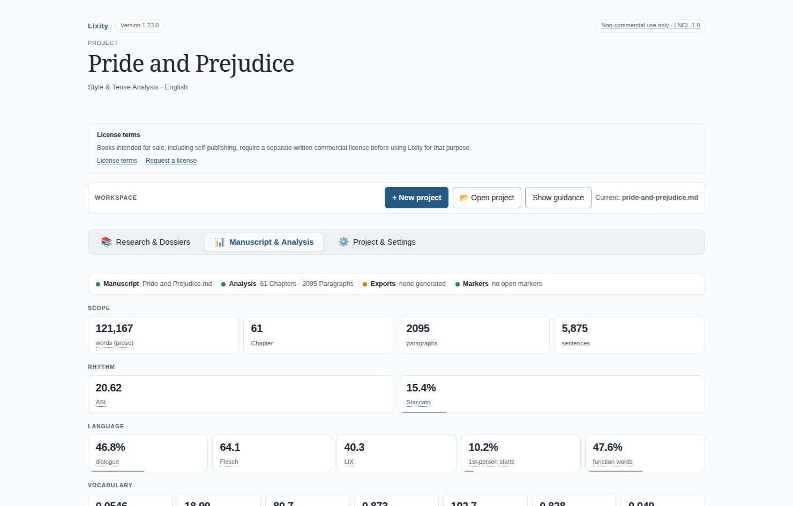
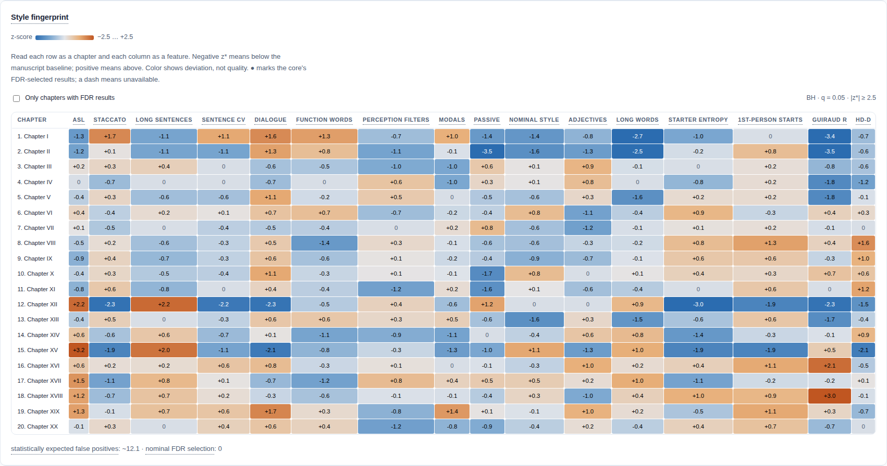
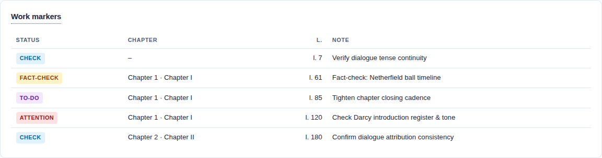
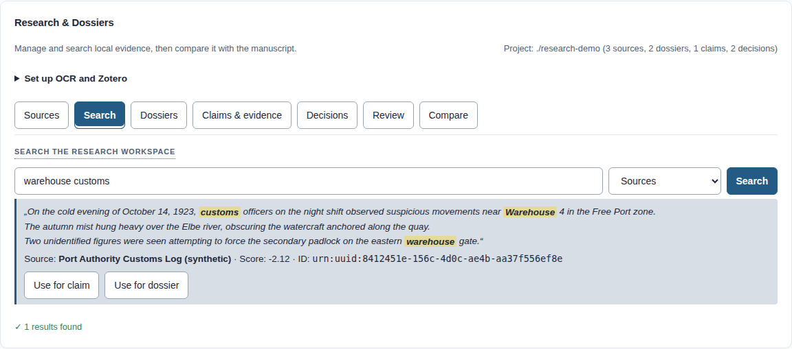
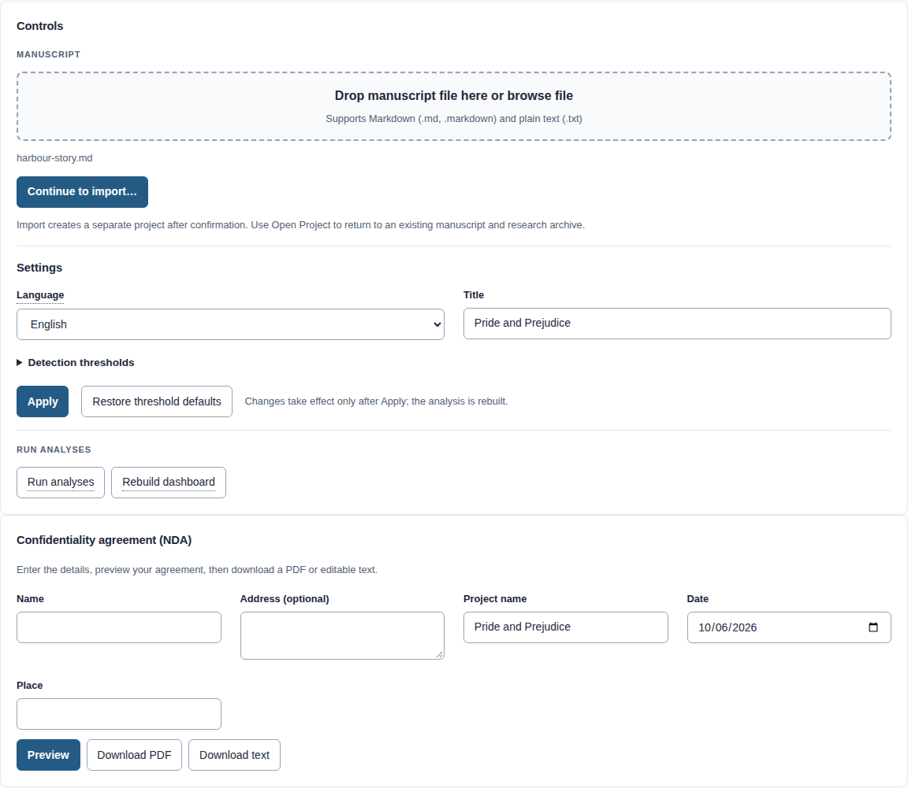
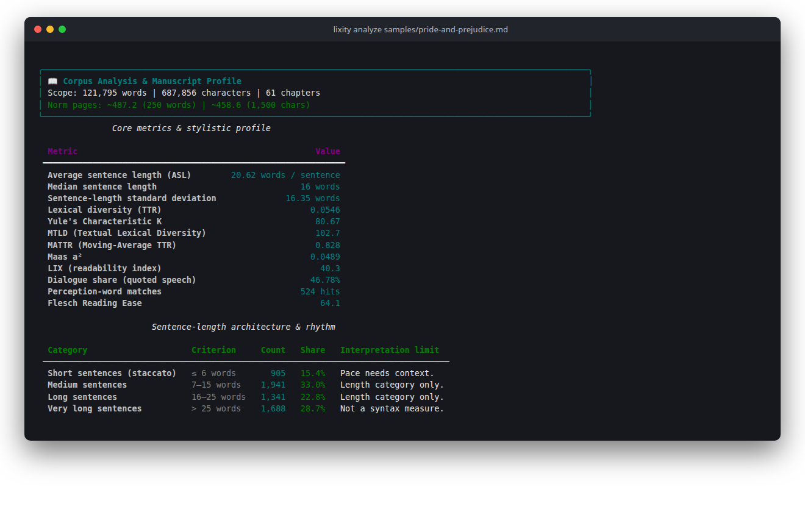

# Lixity

[](https://github.com/mfahsold/lixity/actions)


**Read the patterns in your writing. Keep the evidence behind your decisions.**

Lixity helps authors, editors and researchers explore sentence rhythm, vocabulary,
dialogue and tense. Its local dashboard connects each result with the passages
behind it. You decide what matters for your manuscript.

[Get started](#installation) · [What you can do](#what-you-can-do) ·
[Practical guides](https://mfahsold.github.io/lixity/#guides) ·
[v1.23.0 release notes](docs/releases/v1.23.0.md)

Free for projects with no commercial purpose. A book intended for sale,
including self-publishing, requires a separate written commercial license.
[License details](#license).

## Installation

Lixity runs on Windows, macOS and Linux. It needs Python 3.10 or later.
The commands below run in a terminal and use [uv](https://docs.astral.sh/uv/) and Git.
For help installing these tools, or to use pipx instead, follow the
[installation guide](docs/INSTALLATION.md).

```bash
uv tool install --python 3.12 "git+https://github.com/mfahsold/lixity.git@v1.23.0"
lixity --version
```

This installs the released version. For later upgrades, choose the next release
tag explicitly. [Release notes](docs/releases/v1.23.0.md) describe compatibility
and known limits; the [changelog](CHANGELOG.md) records subsequent work on `main`.

Current `main` also includes scene registers and project targets, guided conflict
resolution, grouped revisions, a decision review view and optional local Tesseract
OCR. These additions are unreleased; see the [command reference](docs/USAGE.md#scene-registers-and-project-targets-current-main-unreleased)
and [research guide](docs/research/USAGE.md#current-main-workflows-unreleased).

## Quick Start

Prepare a UTF-8 Markdown file with `## Chapter title` headings, then run:

```bash
lixity build manuscript.md --language de
```

Open `exports/manuscript_dashboard.html` in your browser. This report works
offline. Use `--language en` for English, or select another
[supported language](#supported-languages). English applies when no language is
selected; automatic detection requires `--language auto`.

For project management, research editing and live settings, start the local
workspace instead:

```bash
lixity serve --no-project --port 8765
```

Open `http://127.0.0.1:8765/`. **Open Project** reconnects an existing folder and
its research archive. **Import Manuscript** previews a selected file and creates
a new project when you confirm. The [first-project guide](docs/ONBOARDING.md)
walks through both choices.

## What you can do

### Understand your writing

See how sentence lengths, vocabulary, dialogue and tense vary throughout your
manuscript. Open the passages behind a result before deciding whether to revise.
Short or empty texts cannot support every comparison; unavailable results are
shown explicitly.

<a href="docs/screenshots/dashboard-light.png"></a>

[Read the language signals](https://mfahsold.github.io/lixity/guides/interpretation.html) ·
[Mobile view](docs/screenshots/dashboard-mobile.png) ·
[Dark theme](docs/screenshots/dashboard-dark.png)

### Compare chapters in context

The chapter map compares each chapter with the manuscript's own baseline. Colours
and dots point to differences worth reading; they do not identify bad prose.
The style view also shows changes across the book and which measured features
contribute to them.

<a href="docs/screenshots/dashboard-heatmap.png"></a>

[Understand chapter comparisons](https://mfahsold.github.io/lixity/guides/interpretation.html#consistency) ·
[Style dimensions](docs/screenshots/dashboard-dimensions.png) ·
[Reference bands](docs/screenshots/dashboard-reference.png)

Current `main` also measures individual scenes. Assign scenes to your own
registers and compare their features with that group's median or targets you
choose. These are descriptive comparisons, with unavailable values shown for
small samples. [Scene example](docs/screenshots/dashboard-scenes.png) ·
[Setup and limits](docs/USAGE.md#scene-registers-and-project-targets-current-main-unreleased).

### Keep review notes beside the text

Inspect paragraphs with their source lines, dialogue and tense labels. Work
markers keep review notes next to the relevant passage in Markdown. Their
visibility in a book export depends on the editor or converter you use.

<a href="docs/screenshots/dashboard-markers.png"></a>

[Work-marker instructions](docs/USAGE.md#work-markers-editor-visible) ·
[Paragraph view](docs/screenshots/dashboard-layer.png)

### Connect sources, claims and decisions

The experimental research workspace keeps selected sources, quotations and notes
in a separate local archive. Group findings into dossiers, link passages to
claims, and record why you made a writing decision. Filter lists by title or tag,
or search the retained text. Saving a source does not establish that it is true.

<a href="docs/screenshots/dashboard-research-search.png"></a>

Bring sources from local files or the optional Zotero Desktop bridge. PDF scans
need a separately configured OCR worker. Import warnings explain when extraction
is incomplete or a requested fallback was used.

On current `main`, **Review** lists explicit decision links and outdated pins
for you to inspect. Dossier edits can be reviewed and saved together, with
conflict previews preserving your draft. Scans can use locally installed
Tesseract without a separate worker service.

[Research guide](https://mfahsold.github.io/lixity/guides/research-pdf.html) ·
[Sources](docs/screenshots/dashboard-research-sources.png) ·
[Claims](docs/screenshots/dashboard-research-claims.png) ·
[Decisions](docs/screenshots/dashboard-research-decisions.png) ·
[Review on current main](docs/screenshots/dashboard-research-review.png) ·
[Related revision preview](docs/screenshots/dashboard-research-change-set.png)

### Choose a project and its settings

Project actions remain available from each workspace view. Preview a manuscript
before importing it, select its analysis language, and adjust which differences
you want to examine. Optional encrypted NDA records sit in a collapsible panel.

<a href="docs/screenshots/dashboard-project-settings.png"></a>

[Project workflow](docs/USAGE.md#dashboard-workflow) ·
[Import preview](docs/screenshots/dashboard-project-import.png) ·
[Mobile settings](docs/screenshots/dashboard-project-settings-mobile.png)

### Read a report in the terminal

Use `lixity analyze manuscript.md --language de` for a readable report, or add
`--json` for software integration. Chapter, paragraph, dialogue, pacing and
research commands are covered in the [command reference](docs/USAGE.md).

<a href="docs/screenshots/cli-analyze.png"></a>

These screenshots use public-domain literature or synthetic project records.
[More views and capture details](docs/screenshots/README.md).

## Mathematical Core

Lixity measures language patterns; it does not grade literary quality or prescribe
a style. A deliberate change in voice, register or subject can explain a signal.

Chapter comparisons use the manuscript's median and median absolute deviation
(MAD). The adjusted score `z* = (x − median) / √(σ² + SE²)` accounts for estimated
sampling noise. Optional BH/BY false-discovery-rate procedures, effect sizes and
structural diagnostics add context under their stated assumptions.

Vocabulary measures include HD-D, MTLD, MATTR, Guiraud R, Maas a² and Yule's K.
Their text-length requirements differ. Readability formulas and word-pattern
heuristics have language-specific limits; no minimum sample size guarantees a
reliable literary conclusion.

Formulas, citations and worked examples live in [Methods](docs/METHODS.md).
The [interpretation guide](https://mfahsold.github.io/lixity/guides/interpretation.html)
explains how to read results; [stability and validation limits](docs/STABILITY.md)
describe what has and has not been established.

## Supported Languages

German (`de`) and English (`en`) have the most extensive linguistic resources and
language-specific fixtures. French (`fr`), Spanish (`es`), Italian (`it`),
Portuguese (`pt`) and Dutch (`nl`) also have localized interfaces and analysis
resources, with narrower heuristic coverage and validation.

Choose the manuscript language explicitly. `LIXITY_LANG=de` selects German
terminal messages independently of `--language de`, which selects German
analysis. Documentation is English; source quotations retain their original
language. Mathematical identifiers and numeric JSON values are language-neutral.

[Language support and limits](docs/LOCALIZATION.md).

## Python API and automation

```python
from lixity import api

metrics = api.analyze(text, language="de")
reference = api.fingerprint(text, language="de", project_config={})
html = api.dashboard(text, language="de", project_config={})
```

CLI, Python and dashboard analysis share one pipeline. Analysis/profile JSON uses
schema **v2**; style JSON uses **v4**. Integrations should pass explicit project
settings when working with several projects.

[Interface contracts](docs/AGENTS.md) · [Architecture](docs/ARCHITECTURE.md) ·
[Research commands](docs/research/USAGE.md) · [Automation summary](docs/llms.txt)

## License

Lixity is **source-available, not Open Source**. LNCL-1.0 permits use only for
projects with no commercial purpose. Private writing, research and education
are not blanket exemptions for commercial projects.

Books intended for sale, including self-publishing, ebooks and print-on-demand,
paid editing, client work and commercial integrations require a separate written
commercial license **before use for that project**. If publication plans change,
contact the maintainer before commercial use or sale.

[Licensing guide](docs/LICENSING.md) · [Full terms](LICENSE) ·
[Commercial enquiries](mailto:mfahsold@googlemail.com?subject=Lixity%20Commercial%20Inquiry)

Maintainer: Matthias Fahsold, Hamburg, Germany. Project operator:
ROST Services GmbH, Rümpel, Germany. [Legal notice](https://mfahsold.github.io/lixity/#impressum).

[Contributing](CONTRIBUTING.md) · [Report a security concern](SECURITY.md) ·
[Sample-text provenance](samples/README.md)
