# Lixity

[](https://github.com/mfahsold/lixity/actions)


**Explore sentence rhythm, vocabulary and tense across your manuscript.**
Lixity turns Markdown into an offline, interactive dashboard. Compare chapters
against the manuscript's own style, then inspect the passages behind each signal.

Python 3.10+ · Seven language profiles · No cloud calls.

The current release is **v1.23.0**, including the experimental local research workspace.
Read the [v1.23.0 release notes](docs/releases/v1.23.0.md) for workspace improvements, metric corrections and import warnings.

**Free only for non-commercial projects.** Using Lixity for a book intended
for sale—including self-publishing—requires a separate written commercial
license. [Examples and terms](docs/LICENSING.md).


```bash
lixity build manuscript.md --language en
```

Open `exports/manuscript_dashboard.html`.
[Onboarding Guide](docs/ONBOARDING.md) · [Install Lixity](#installation) · [Usage](docs/USAGE.md) · [Methods](docs/METHODS.md)

Practical web guides: [install and open a project](https://mfahsold.github.io/lixity/guides/installation.html),
[interpret manuscript metrics](https://mfahsold.github.io/lixity/guides/interpretation.html),
and [archive sources and PDFs](https://mfahsold.github.io/lixity/guides/research-pdf.html).

## Choose your workflow

| Goal | Start here |
| :--- | :--- |
| Inspect a Markdown manuscript offline | [Quick start](#quick-start), then the [interpretation guide](https://mfahsold.github.io/lixity/guides/interpretation.html) |
| Open or create a local project | [Onboarding](docs/ONBOARDING.md): `lixity serve --no-project --port 8765` |
| Manage literature in Zotero and retain selected evidence | [Zotero Desktop setup](docs/research/USAGE.md#zotero-desktop-bridge-since-v1190) |
| Search sources, dossiers and author decisions | [Current-record search](docs/research/USAGE.md#search-current-authored-records-since-v1190): `--scope all` or a type filter |
| Integrate the engine or automate a workflow | [Python and JSON contracts](docs/AGENTS.md), [architecture](docs/ARCHITECTURE.md) |
| Understand a result or its limits | [Methods](docs/METHODS.md), [stability and validation limits](docs/STABILITY.md) |

## Current release: v1.23.0

Release v1.23.0 makes the workspace easier to navigate and the diagnostics easier
to interpret:

- **Clear project workflows:** three workspace views, persistent New/Open actions,
  file selection before explicit import, local source/dossier filters and an
  initially collapsed NDA manager.
- **Consistent dialogue counts:** corpus, chapter, paragraph, dialogue and pacing ratios use
  the same configured word tokenizer, including adjacent punctuation.
- **Honest diagnostic limits:** unavailable Show/Tell comparisons display dashes;
  chapter-based scene estimates explain their units. Localized help describes
  literary signals without turning them into quality scores or writing rules.
- **Visible PDF import warnings:** invalid OCR configuration remains unready, and
  explicit native fallback carries extraction warnings through local, batch and
  Zotero import results.
- **Reviewed visual documentation:** 35 desktop and mobile screenshots cover
  project dialogs, research workflows, analysis views and optional NDA controls.

The optional **Zotero Desktop bridge** (since v1.19.0) continues to let Zotero manage literature and media while Lixity retains selected evidence, dossiers, claims and author decisions.

Read the [v1.23.0 release notes](docs/releases/v1.23.0.md) before upgrading an archive.
Documentation on `main` may describe newer changes; use the
[tagged documentation](https://github.com/mfahsold/lixity/tree/v1.23.0/docs) for
the released package and [changelog](CHANGELOG.md) for subsequent changes.

The server dashboard separates Research & Dossiers,
Manuscript & Analysis, and Project & Settings. New Project, Open Project and
optional guidance remain accessible from every view. Selecting or dropping a
manuscript shows its filename without submitting it. In the native server,
**Continue to import…** opens the existing Import Manuscript dialog; confirmation
creates a separate project. Use **Open Project** to return to an existing archive.
Source and dossier lists have local metadata filters, and the NDA manager starts
collapsed when available. See the [dashboard workflow](docs/USAGE.md#dashboard-workflow)
for import, embedding and filter boundaries.

## What you can do

Explore your manuscript and keep your research traceable.

| Task | What Lixity helps you do | Learn more |
| :--- | :--- | :--- |
| **Understand your writing** | Explore sentence rhythm, vocabulary, dialogue and tense. Read the passages behind the results to judge what matters for your text. | [Language signals and their limits](https://mfahsold.github.io/lixity/guides/interpretation.html#editorial-matrix) |
| **Compare your chapters** | See how chapters differ from the rest of the manuscript and where language patterns change as the book progresses. | [Chapter comparisons](https://mfahsold.github.io/lixity/guides/interpretation.html#consistency) |
| **Connect research and decisions** | Bring selected sources from Zotero or local files into the experimental research workspace. Link passages to claims, build dossiers and record the reasoning behind authorial decisions. | [Research workflow](https://mfahsold.github.io/lixity/guides/research-pdf.html) |

Lixity runs locally. Analysis highlights patterns for human review; it does not
grade literary quality or establish whether a claim is true. Work markers keep
review notes near their passages. For shared pipeline, Python API and dashboard
integration, see [Architecture and project adapters](#architecture-and-project-adapters).

## Mathematical Core

| Estimator / Method | Role in System |
| :--- | :--- |
| Robust baseline x̃, MAD, σ = 1.4826 · MAD | Manuscript-intrinsic house-style corridor per feature |
| Noise-aware z\* = (x − x̃) / √(σ² + SE²) | Shrinks sampling noise in short chapters via analytical SE |
| BH / BY FDR at q (default: 0.05) | Multiplicity-controlled `fdr_flagged` cells |
| Expected FP = m · P(\|Z\| ≥ z_mild) | Calibration against statistical over-interpretation |
| Cliff’s δ | Non-parametric effect-size labels for flagged cells |
| Runs test + Lag-1 ρ₁ | Exchangeability diagnostics (I.I.D. baseline assumption) |
| Spearman ρ + cyclic Jacobi EVD | Latent style dimensions and principal axes (pure stdlib) |
| PELT changepoints (BIC) | Locates structural regime shifts in the house style |
| Mann–Kendall τ, S, p | Detects monotonic feature drift across chapter progression |
| Sn / Qn (Rousseeuw & Croux) | Outlier-resistant alternative scale cross-checks to MAD |
| Hill tail index (α̂) | Diagnostics for heavy-tailed feature distributions |
| 1D Wasserstein + 2-sample KS | Distributional shift between early and late manuscript halves |
| Dunning G² + Co-occurrence fitness | Lexical keyness and Goh–Barabási network architecture |

Thresholds (`z_mild`, `z_strong`, `fdr_q`, `fdr_method`, `dim_score_threshold`, `flag_min_severity`) are fully configurable via CLI flags, API kwargs, UI settings, or `[tool.lixity]` project configuration (resolution order in [`docs/METHODS.md`](docs/METHODS.md)).

## Key Capabilities

- **Offline & Reproducible Analysis:** Fixed inputs, settings and interpreter produce repeatable metrics. Floating-point last bits may differ across platforms; research revisions also carry identifiers and timestamps.
- **Self-Calibrating Norms:** House style derived from the manuscript's own median and MAD bands.
- **Noise-Aware z\* + FDR (BH/BY):** Configurable significance procedure with assumptions and diagnostic limits.
- **Effect Sizes & Diagnostics:** Cliff’s δ, Runs test, and lag-1 autocorrelation for flagged cells.
- **Structural Diagnostics:** PELT changepoints, Mann–Kendall trends, Sn/Qn scales, Hill tail index, Wasserstein–KS shift, Goh–Barabási co-occurrence graphs, and Dunning G² keyness.
- **Latent Style Dimensions:** Spearman rank correlation and cyclic Jacobi eigendecomposition (pure Python stdlib).
- **Paragraph-Level Tense Profiling:** Present, past, mixed, neutral with a 0–3 friction severity scale.
- **Narratological Structure Modules:** Dialogue turn structure, character presence, scene/pacing curves, motifs, and showing vs. telling balance.
- **Idempotent Workspace Build & Dashboard:** Fully self-contained, single-file interactive HTML dashboard with 7 language profiles.
- **AI Agent-Ready:** Strict JSON schemas (analyze/profile **v2**, style **v4**), stable `lixity.api` facade, [`docs/AGENTS.md`](docs/AGENTS.md).

## Visual Analytical Suite

These captures show the **v1.23.0 UI** on 3 October 2026. Click any image for its full-size PNG. Manuscript
analysis uses the public-domain *Pride and Prejudice* sample; project and research
workflows use synthetic files, paths and customs-case archive records.
Dialog images show complete forms; long dialogs scroll in the application.

### 1. Project navigation, settings & import

| Welcome & project navigation | Create from a template |
| :---: | :---: |
| <a href="docs/screenshots/dashboard-welcome.png">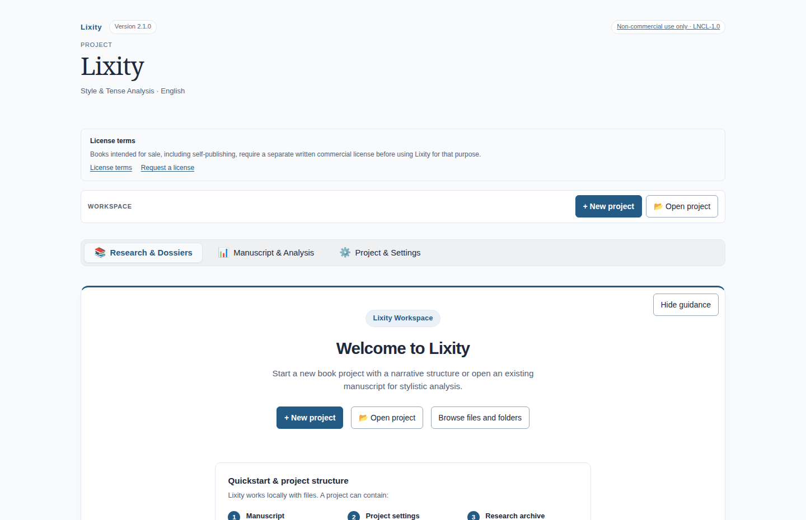</a> | <a href="docs/screenshots/dashboard-project-modal.png">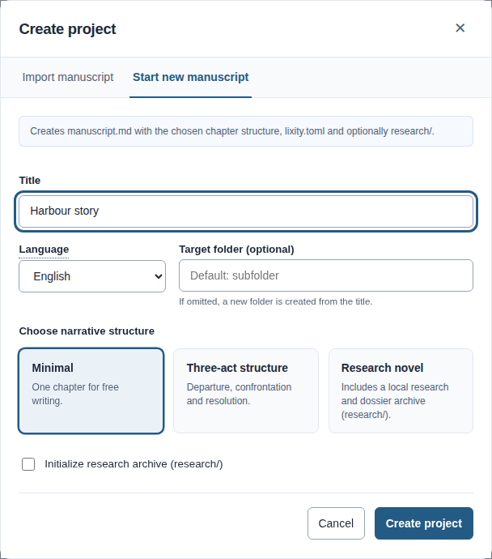</a> |
| *New/Open actions and optional guidance remain reachable across the three views.* | *Choose a title, language and starting structure before confirming a new project.* |

| Open an existing project | Open Project on mobile |
| :---: | :---: |
| <a href="docs/screenshots/dashboard-project-open.png">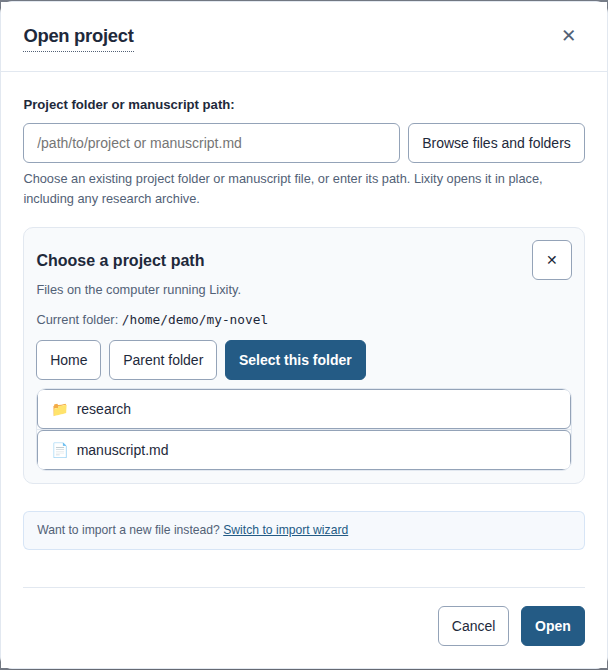</a> | <a href="docs/screenshots/dashboard-project-open-mobile.png">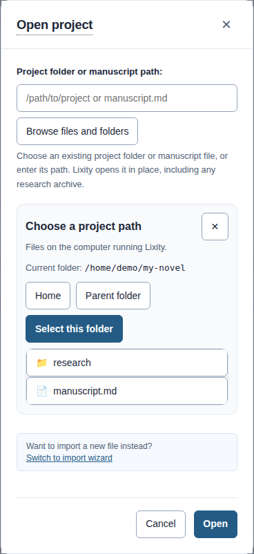</a> |
| *Choose a folder or manuscript, then confirm Open to reconnect its existing research archive.* | *Browse server-local paths or enter a path; selection alone does not open a project.* |

| Project & Settings | Project & Settings on mobile |
| :---: | :---: |
| <a href="docs/screenshots/dashboard-project-settings.png"></a> | <a href="docs/screenshots/dashboard-project-settings-mobile.png">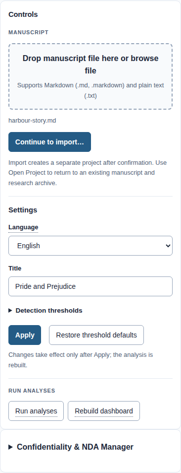</a> |
| *Choose or drop a manuscript before Continue to import. Settings change after Apply; the optional NDA manager starts collapsed.* | *The same manuscript, language and threshold controls in a narrow layout. File selection alone sends no request.* |

| Review an import | Review an import on mobile |
| :---: | :---: |
| <a href="docs/screenshots/dashboard-project-import.png">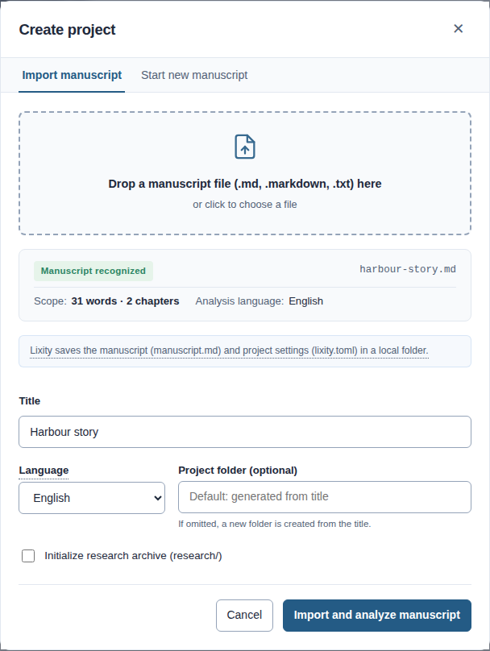</a> | <a href="docs/screenshots/dashboard-project-import-mobile.png">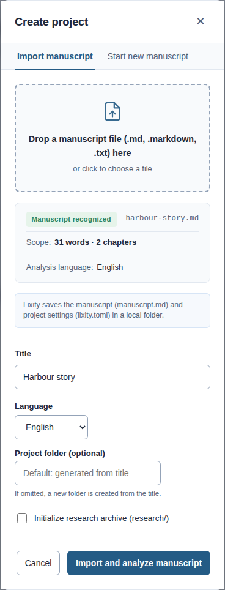</a> |
| *Preview the selected file, title and language locally. Confirmation creates a separate project; use Open Project for an existing archive.* | *The file remains a local selection until confirmation; cancelling leaves the current project unchanged.* |

| Locked NDA preview | Locked NDA preview on mobile |
| :---: | :---: |
| <a href="docs/screenshots/dashboard-nda.png">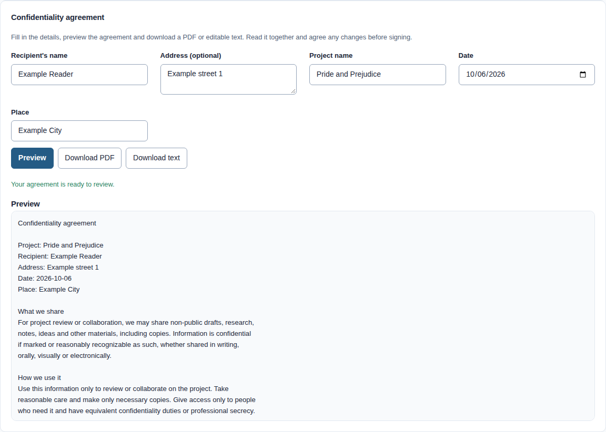</a> | <a href="docs/screenshots/dashboard-nda-mobile.png">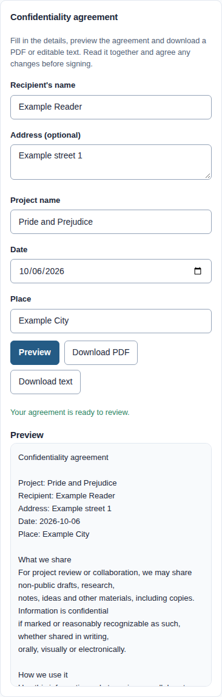</a> |
| *The native details panel starts collapsed. This expanded locked-state preview contains no agreements, passphrase or private records.* | *The optional confidentiality controls use the same collapsible panel at mobile width; no agreement is created.* |

### 2. Manuscript overview & departure heatmap

| Analysis overview | Analysis overview on mobile |
| :---: | :---: |
| <a href="docs/screenshots/dashboard-light.png"></a> | <a href="docs/screenshots/dashboard-mobile.png">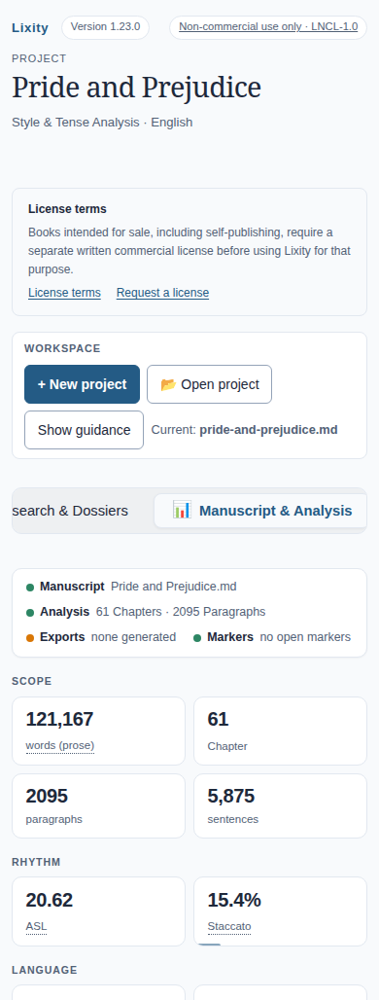</a> |
| *Sentence rhythm, readability and lexical signals for the public-domain sample. Statistical signals support a human review.* | *Project navigation and grouped corpus metrics remain available at mobile width.* |

<a href="docs/screenshots/dashboard-heatmap.png"></a>

*Noise-adjusted z\* values compare chapters with this manuscript’s baseline. Dots mark cells selected by the configured FDR procedure. These are review signals under model assumptions, not confirmed defects; only the first 20 rows are shown.*

### 3. Paragraph inspection & work markers

| Paragraph style layer | Editorial work markers |
| :---: | :---: |
| <a href="docs/screenshots/dashboard-layer.png">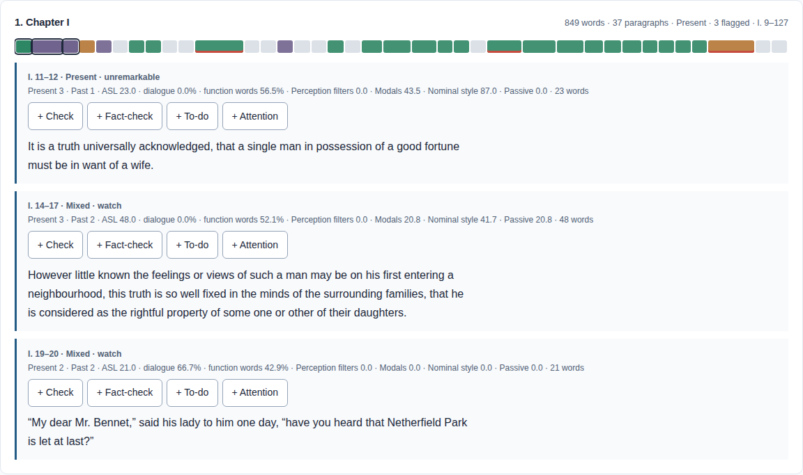</a> | <a href="docs/screenshots/dashboard-markers.png"></a> |
| *Verbatim sample prose with source line anchors, tense classification and local sentence rhythm.* | *Synthetic notes are added only to an in-memory sample copy. The public-domain source file is unchanged.* |

### 4. Style dimensions & manuscript reference bands

| Chapter style space | Reference bands |
| :---: | :---: |
| <a href="docs/screenshots/dashboard-dimensions.png">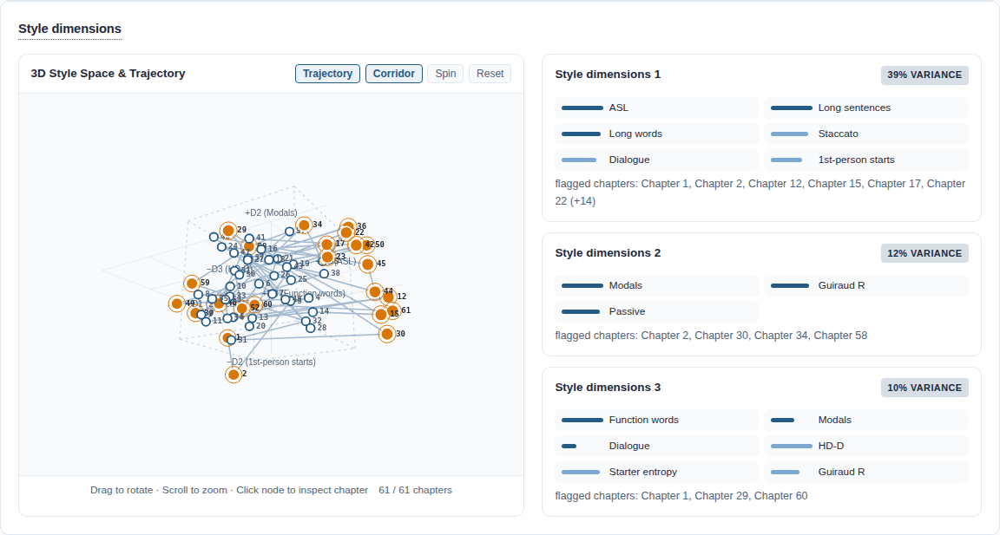</a> | <a href="docs/screenshots/dashboard-reference.png">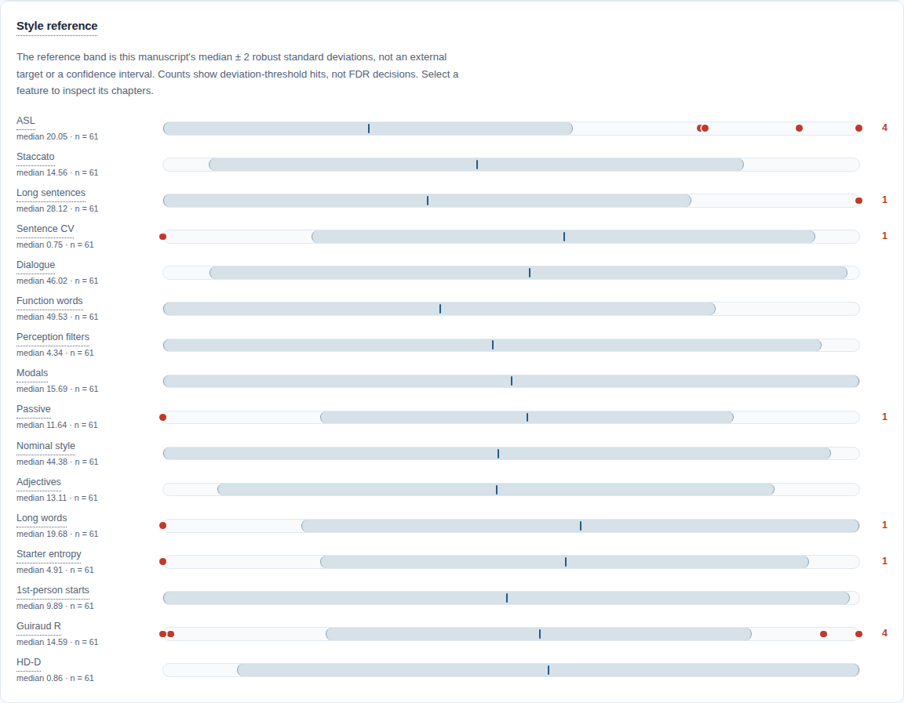</a> |
| *Chapter positions and feature loadings describe variation within the manuscript, with links back to each chapter.* | *Robust median/MAD corridors with visible sample counts and deviation thresholds.* |

| Style dimensions on mobile | Style dimensions in dark mode |
| :---: | :---: |
| <a href="docs/screenshots/dashboard-dimensions-mobile.png">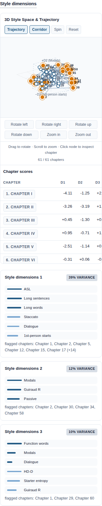</a> | <a href="docs/screenshots/dashboard-dimensions-dark.png">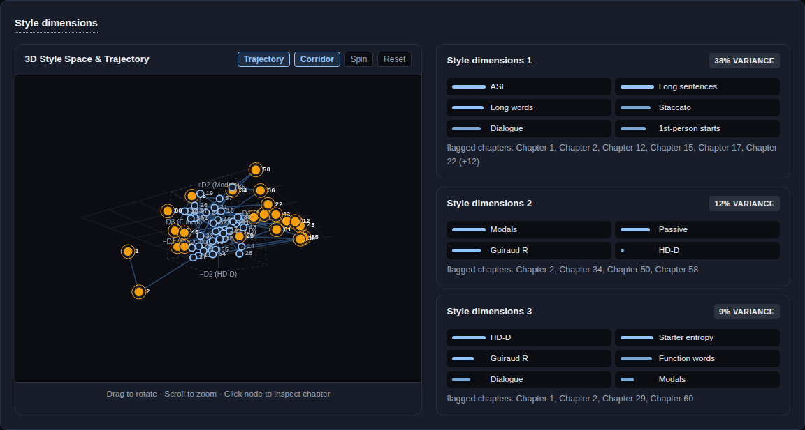</a> |
| *The complete dimension panel with stacked controls and readable feature loadings.* | *The same chapter analysis and feature loadings in the dark palette.* |

### 5. Terminal reports & display settings

| Corpus diagnostics | Style reference |
| :---: | :---: |
| <a href="docs/screenshots/cli-analyze.png"></a> | <a href="docs/screenshots/cli-style.png">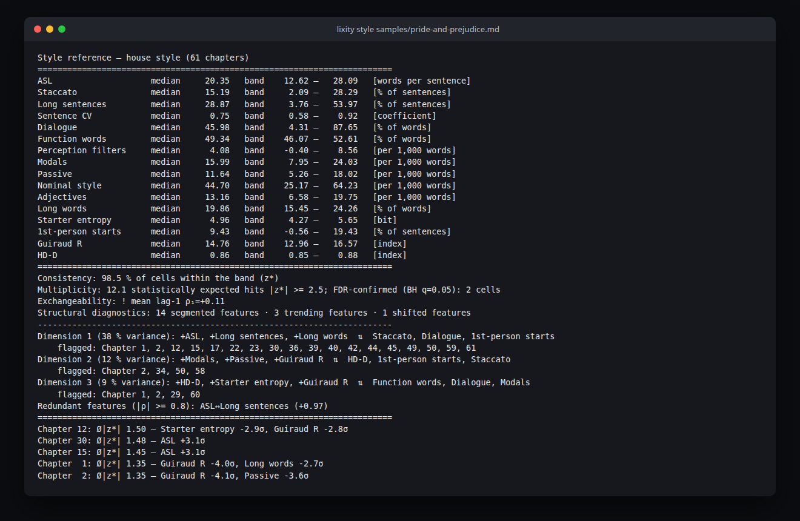</a> |
| *Actual lixity analyze output for the public-domain manuscript sample.* | *Actual lixity style output with within-manuscript bounds and structural diagnostics.* |

| Expanded analysis settings | Analysis in dark mode |
| :---: | :---: |
| <a href="docs/screenshots/dashboard-settings.png">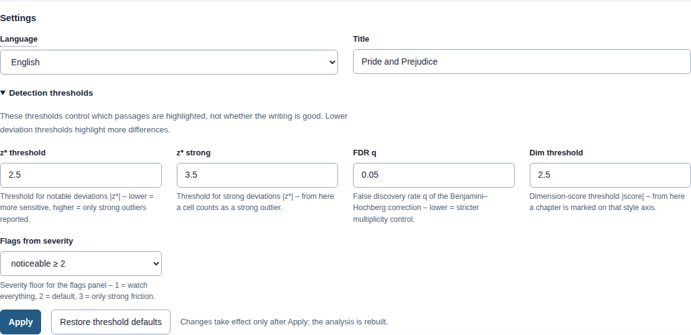</a> | <a href="docs/screenshots/dashboard-dark.png">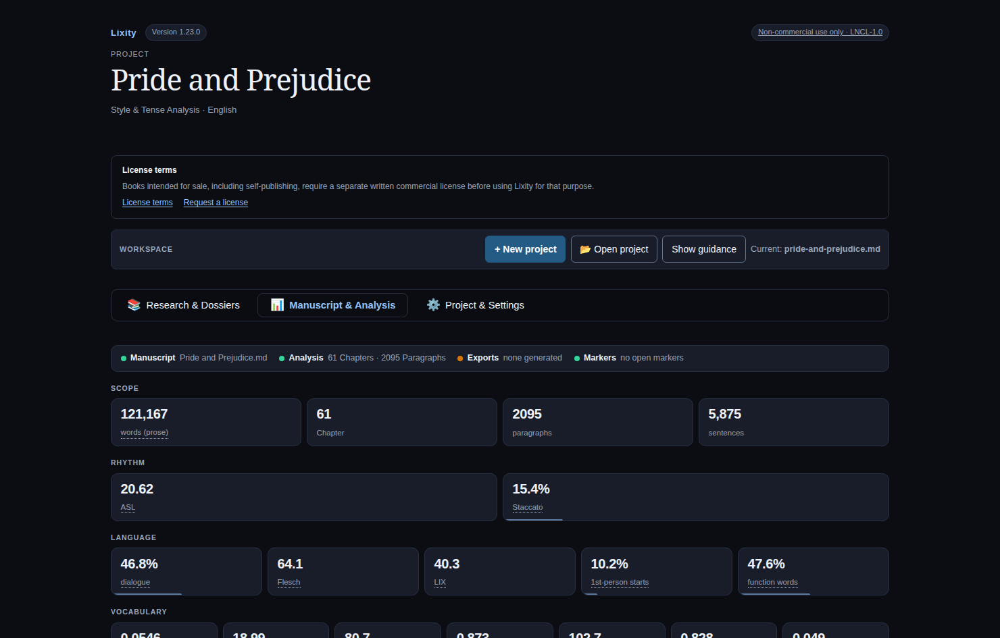</a> |
| *Threshold changes take effect after Apply. Restoring defaults fills the form without saving until Apply.* | *An alternative palette for the same public-domain manuscript analysis.* |

### 6. Research lists, archive search & review records

Local list filters inspect loaded metadata without sending requests while typing.
They preserve opened details and complete association choices. Full-text archive
search is a separate action in the Search tab.

| Retained sources | Sources on mobile |
| :---: | :---: |
| <a href="docs/screenshots/dashboard-research-sources.png">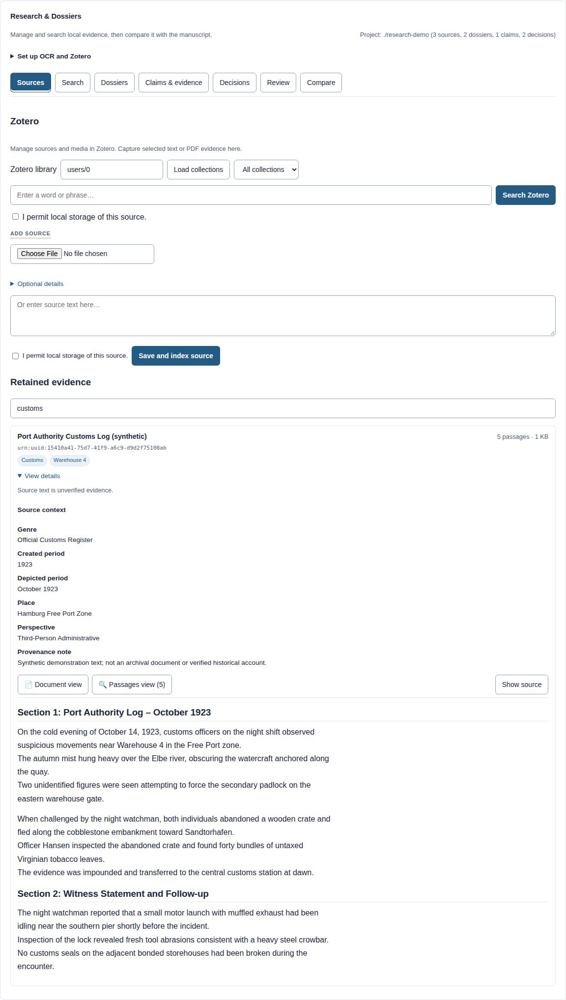</a> | <a href="docs/screenshots/dashboard-research-sources-mobile.png">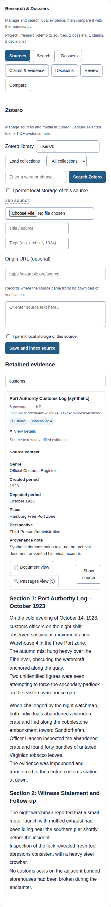</a> |
| *Filter loaded titles, tags and IDs in the synthetic customs case. The filter does not search retained source text.* | *The same local source filter, archive metadata and detail controls at mobile width.* |

| Dossiers | Dossiers on mobile |
| :---: | :---: |
| <a href="docs/screenshots/dashboard-research-dossiers.png">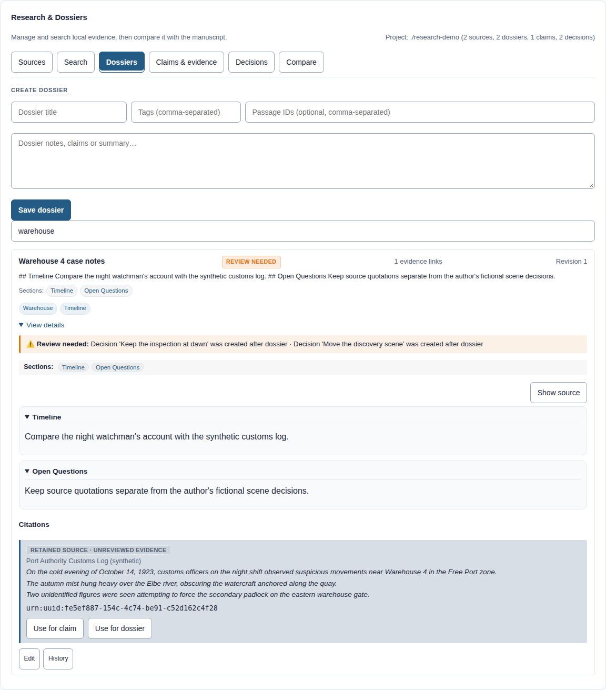</a> | <a href="docs/screenshots/dashboard-research-dossiers-mobile.png">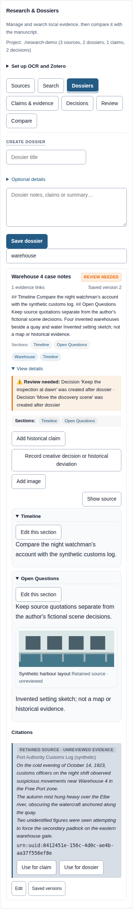</a> |
| *Local dossier filters also match excerpts and section names; they do not search full dossier bodies.* | *Inspect dossier excerpts, sections and record details in a narrow layout.* |

| Full-text archive search | Archive search on mobile |
| :---: | :---: |
| <a href="docs/screenshots/dashboard-research-search.png"></a> | <a href="docs/screenshots/dashboard-research-search-mobile.png">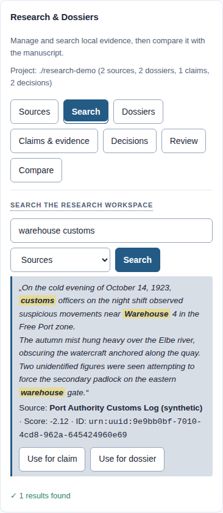</a> |
| *Submit an explicit query, then inspect retained passages or use them for a claim or dossier.* | *Search uses retained text and remains separate from the local list filters.* |

| Claims & evidence | Claims on mobile |
| :---: | :---: |
| <a href="docs/screenshots/dashboard-research-claims.png">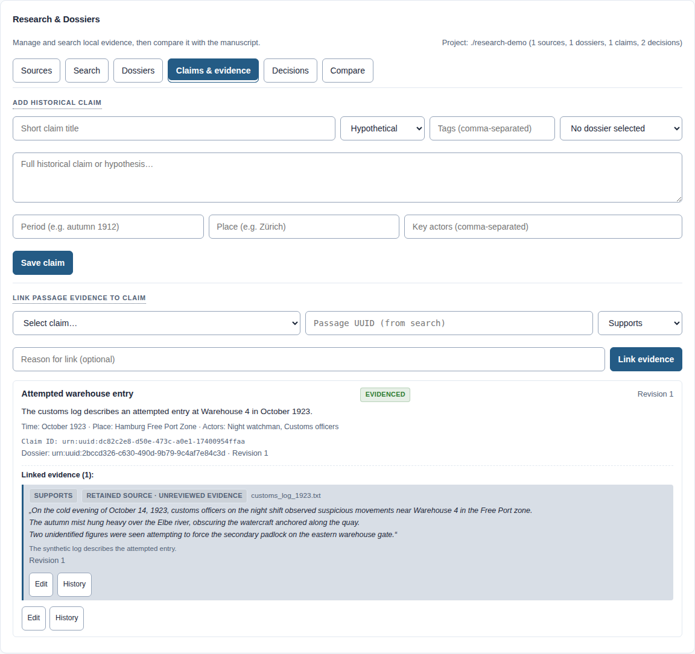</a> | <a href="docs/screenshots/dashboard-research-claims-mobile.png">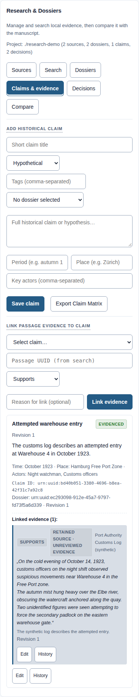</a> |
| *Evidence links retain the quoted passage and citation provenance. Archive integrity does not establish historical accuracy.* | *Review the same claim, original passage and evidence link in a narrow layout.* |

| Editorial decisions | Decisions on mobile |
| :---: | :---: |
| <a href="docs/screenshots/dashboard-research-decisions.png">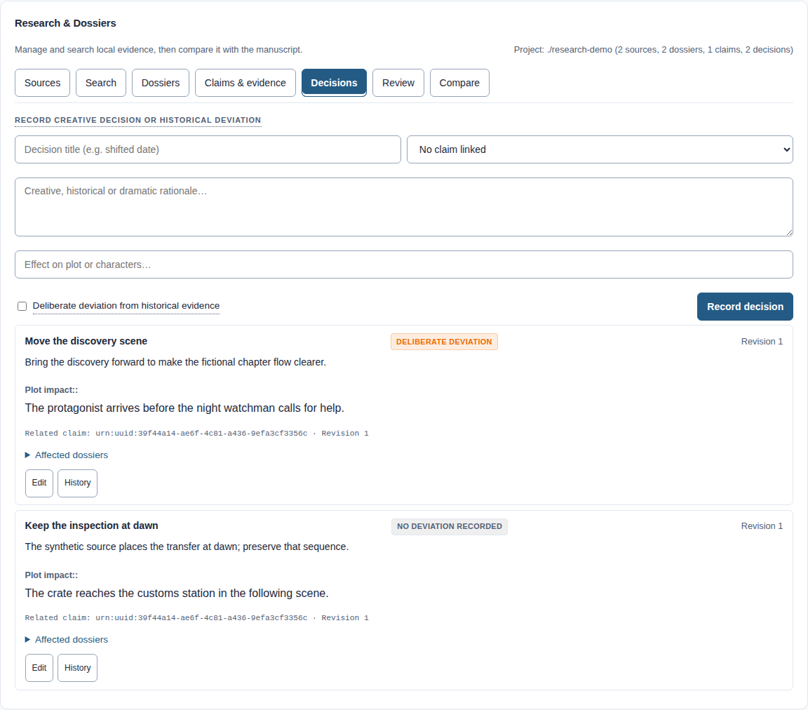</a> | <a href="docs/screenshots/dashboard-research-decisions-mobile.png">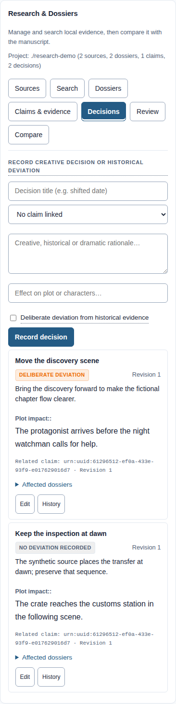</a> |
| *Author-recorded choices can preserve or deliberately depart from source evidence; the records are not automatic factual verdicts.* | *The same decision records, rationale and claim links at mobile width.* |

| Archived source analysis | CLI search & citation |
| :---: | :---: |
| <a href="docs/screenshots/dashboard-research.png">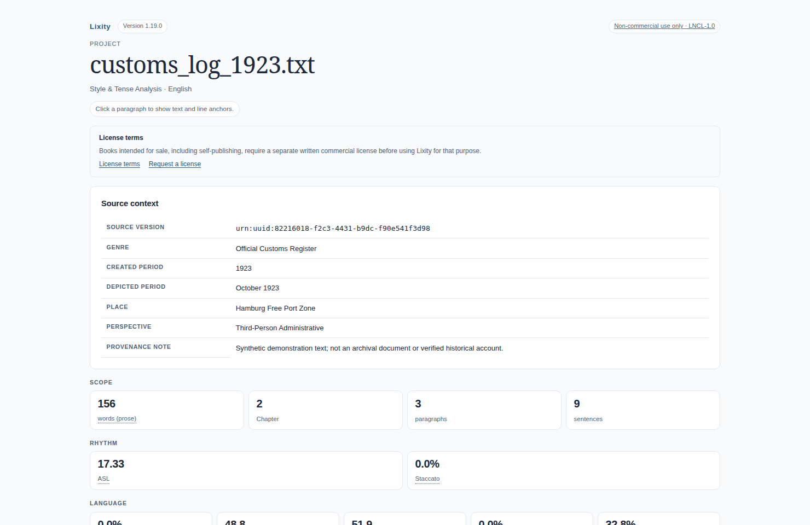</a> | <a href="docs/screenshots/cli-research.png">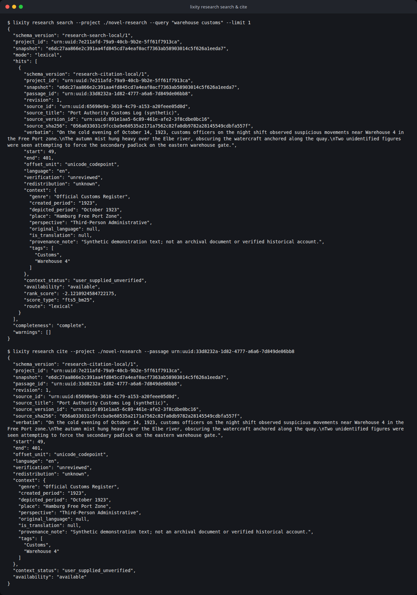</a> |
| *Genre, period, place and provenance metadata are supplied by the user and remain unverified context.* | *Complete search/cite output from the disposable synthetic archive, including passage IDs and exact character offsets.* |

These screenshots illustrate workflows and statistical signals, not validated
editorial judgments. [Screenshot provenance and regeneration](docs/screenshots/README.md).

## Installation

Install from GitHub into an isolated CLI environment. Requires Git and
[uv](https://docs.astral.sh/uv/getting-started/installation/); uv can supply
Python 3.12. Source-available under LNCL-1.0, **non-commercial use only**, not PyPI.

```bash
uv tool install --python 3.12 "git+https://github.com/mfahsold/lixity.git@v1.23.0"
lixity --version
lixity about
```

This installs **v1.23.0**, including the experimental local research pilot.
The tag stays pinned: upgrading to a future release requires selecting
its tag explicitly. Use `@main` only for development builds, or a reviewed
full commit hash for reproducible deployments.

**[Full installation guide](docs/INSTALLATION.md):** Windows/macOS/Linux,
pipx alternative, Python API environments, PATH repair, upgrades and removal.
Python 3.10+ supports the engine and TOML project settings; Python 3.10 uses
the conditional `tomli` dependency.

For engine development:

```bash
git clone https://github.com/mfahsold/lixity.git && cd lixity
make install-dev        # venv + pip install -e ".[dev]"
make check              # ruff + mypy --strict + pytest -W error

```

`make install` creates a local `.venv` without dev tools; both installation
targets verify dependencies and version, without changing global Python.

## Quick Start

Start with a UTF-8 Markdown manuscript using `## Chapter title` headings:

```bash
lixity build manuscript.md --language en
```

Open `exports/manuscript_dashboard.html`. Use `--language de` for German or
explicit `--language auto` for detection. No account, API key or upload is needed.
For live settings, project management and research editing, run `lixity serve`.
Standalone HTML is an analysis report, not a running project server. Publication
typesetting and delivery adapters remain external, while native encrypted NDA
tracking is built into Lixity (`ProjectNdaProvider` and `lixity build`).

Other commands (all analysis commands default to English):

```bash
lixity serve --no-project --port 8765        # Native dev server & onboarding wizard
lixity analyze manuscript.md                 # Rich terminal report (--json for machines)
lixity profile manuscript.md                 # Tense continuity, paragraph by paragraph
lixity style manuscript.md                   # Style reference (BH/BY, δ, diagnostics)
lixity dialogue manuscript.md                # Turn structure and speech ratio per chapter
lixity characters manuscript.md --names "Anna,Ralf" # Character presence
lixity pacing manuscript.md                  # Scenes, tempo, and chapter hooks
lixity motifs manuscript.md --motif 'Wut=\b(Wut|wütend\w*)\b' # Motifs & repetition
lixity showing manuscript.md                 # Showing vs. telling per chapter
lixity dashboard manuscript.md -o exports/dashboard.html # Interactive HTML dashboard
lixity research --help                       # Evidence archive, claims & decisions
cd my-novel && lixity build                  # Idempotent workspace: exports/ + archive
lixity about                                 # Languages, heuristics, and metadata
```

Common sensitivity flags (for `style`, `dashboard`, and `build`):

```bash
lixity style manuscript.md --json \
  --z-mild 2.5 --z-strong 3.5 --fdr-q 0.05 --fdr-method bh \
  --dim-threshold 2.5 --flag-min-severity 2
```

Project-wide defaults: place the same keys under `[tool.lixity]` in
`pyproject.toml`, or in `lixity.toml` / `~/.config/lixity.toml`
(CLI flag > UI session > project config > user config > code defaults).

Use `--min-chapters 4` with `style`, `dashboard` or `build` to require at least
four usable chapters for a style baseline (default: 2). API callers can pass
`min_chapters=4, project_config={}` to `fingerprint`/`passport` or `dashboard`
to avoid implicit threshold lookup. Language remains an explicit argument.

Test with the bundled public-domain samples:

```bash
lixity analyze samples/effi-briest.md --language de  # German – Fontane, 36 chapters
lixity analyze samples/pride-and-prejudice.md  # English – Austen, 61 chapters
```

CLI message localization is separate from analysis language: `LIXITY_LANG=de`
selects German CLI messages, while `--language de` selects German analysis.

Full command reference, metric glossary, worked example, and troubleshooting:
[`docs/USAGE.md`](docs/USAGE.md). Agent-facing JSON contracts:
[`docs/AGENTS.md`](docs/AGENTS.md). Project website:
[mfahsold.github.io/lixity](https://mfahsold.github.io/lixity/).

## Architecture and project adapters

The experimental [local research workspace](docs/research/USAGE.md) archives UTF-8 sources and PDFs,
attaches versioned source criticism context and tags, resolves exact citations, connects to the
analysis pipeline, manages dossiers with cited evidence, provides an interactive web
management UI in `lixity serve`, supports controlled withdrawal and purge, and compares
vocabulary grounding against literary manuscripts. Embeddings and hybrid vector search remain in the
[target architecture](docs/research/README.md).

CLI commands and the Python API share `lixity.pipeline`: language resolution,
paragraph profiling and fingerprint construction have one implementation.
`analyze_document` computes corpus metrics once and returns a typed
`DocumentAnalysis`; renderers only consume results. UI panels reuse central
components and bundled assets, without a frontend build or CDN.

Project adapters own file access, publication exports and local services—not
copies of analysis algorithms. For multiple projects in one process, pass an
explicit configuration instead of changing the working directory:

```python
from lixity.config import load_project_config, resolve_thresholds
from lixity.pipeline import analyze_document, resolve_document_config

settings = load_project_config("/path/to/project")
thresholds = resolve_thresholds(project_config=settings)
config, language = resolve_document_config(text, settings.get("language", "en"))
result = analyze_document(text, config, thresholds)
```

An empty `project_config={}` isolates thresholds from user/project files;
explicit threshold arguments override the supplied mapping. The pipeline itself
does not read files, discover projects or maintain global session state.

Adapters using the shared pipeline require Lixity 1.15.0 or newer.
See [architecture and integration boundaries](docs/ARCHITECTURE.md) for the
configuration contract and [language support](docs/LOCALIZATION.md) for its
scope, guarantees and limitations.

## What Lixity Measures

Detailed formulas, mathematical derivations, and academic citations are documented in [`docs/METHODS.md`](docs/METHODS.md) and [`docs/USAGE.md`](docs/USAGE.md#understanding-the-metrics):

1. **Sentence Architecture & Rhythm** – Average sentence length (ASL), coefficient of variation (CV), and distribution across four syntactic length tiers (staccato ≤ 6 words, medium 7–15, long 16–25, very long > 25 words). These length bins can prompt a closer reading of rhythm; sentence length alone does not establish syntactic complexity or pacing quality.
2. **Lexical Diversity with Length Guards** – Type-Token Ratio (TTR), Guiraud R, hypergeometric HD-D (McCarthy & Jarvis 2010), MTLD, moving-average MATTR, Maas a², and Yule's characteristic K. Minimum token counts reduce unstable short-text results; none makes chapters of different lengths perfectly comparable.
3. **Language-Specific Readability Formulas** – Standard LIX (Björnsson, words > 6 characters for all languages) and language-specific Flesch variants: Amstad (de), classic Flesch (en), Kandel-Moles (fr), Szigriszt-Pazos (es), Franchina-Vacca (it), Martins (pt), and Douma (nl). These formula outputs are not a measure of literary quality.
4. **Narrative Voice & Register** – Dialogue ratio, function-word density (the author's implicit grammatical fingerprint), perception filters ("telling" verbs like *saw*, *heard*, *felt*), modal hedging, passive voice, nominal style suffixes, sentence-starter Shannon entropy, and first-person openings.
5. **Tense Dynamics & Continuity** – Paragraph-level heuristic classification into dominant tense (present, past, mixed, neutral) with a 4-tier friction severity rating (0–3) to highlight possible changes. The heuristic cannot determine whether a shift was intended.

## Editorial Practice: The Macro-Editing Matrix

Statistical indicators are not an objective quality score or an instruction to rewrite prose. The questions below are possible readings of a signal, not diagnoses or required interventions:

| Linguistic Feature | Calculation & Diagnostic Signal | Editorial Interpretation & Practical Editing | Warning Signal & Editorial Intervention |
| :--- | :--- | :--- | :--- |
| **Sentence Rhythm & Length Tiers** | ASL, rhythm CV, short (≤6w), very long (>25w) | **Pacing:** Variation in sentence length can draw attention to shifts between action, dialogue, and reflection. | Low or high CV and changes in long-sentence frequency invite a read of the affected passage; neither implies good or bad prose. |
| **Lexical Diversity** | Hypergeometric HD-D, MTLD, Yule's K, Maas a² | **Vocabulary Pattern:** These measures reduce some length sensitivity compared with raw TTR, subject to their token floors and corpus context. | A change late in the manuscript may prompt a look at repetition, dialogue mix, or topic shifts; it does not identify author fatigue or a quality problem. |
| **Tense Continuity & Friction** | Present, past, mixed, neutral; friction rating 0–3 | **Timeline & Perspective:** Heuristic labels help locate tense changes at paragraph scale. | Higher friction may merit a check of quotation, dialogue, flashback, or deliberate perspective shifts before treating it as an error. |
| **Showing vs. Telling & Filters** | Perception verbs, passive voice, nominal style | **Register:** Word-pattern counts highlight possible changes in viewpoint or exposition. | Read passages in context; these constructions can be deliberate and their counts do not measure immersion. |
| **FDR Heatmap** | Noise-aware z\*, Benjamini–Hochberg or BY (●), Cliff's δ | **Statistical Review:** A dot marks a cell passing the configured FDR procedure under its assumptions. Effect size adds context. | Read flagged passages in context; a flag neither proves a defect nor calls for a rewrite. Unflagged passages can still matter artistically. |
| **Structural & Drift Diagnostics** | PELT changepoints (BIC), Mann–Kendall τ, Wasserstein–KS | **Narrative Structure:** These measures locate changes and trends in the selected features. | A change point can prompt review of scene, character, or chapter context; it does not identify an author handover or its cause. |
| **Persistent Work Markers** | Content-hashed `<!-- LIXITY-MARKER -->` tags | **Traceable Editorial Annotations:** HTML comments keep notes beside the target paragraph in Markdown. Export visibility depends on the converter and its settings. | Content hashes identify the originally marked paragraph; review anchors after manuscript edits. |

## Work Markers (Editor-Visible)

Work markers are standard HTML comment lines placed directly above the target paragraph:

```markdown
<!-- LIXITY-MARKER id="m-7f8a1c9b" kind="pruefen" note="Verify tense shift" created="…" -->
He walked to the window and watches the rain falling outside.
```

- Editable as HTML comments in Markdown editors. Rendering and export behavior
  depend on the editor or converter; inspect the generated book.
- Deterministic content-hash IDs remain anchored even as surrounding text shifts during revision.
- Clicking a marker kind in the dashboard opens an inline note field directly in the document
  (`Enter` saves, `Esc` cancels).
- Programmatic access via `api.markers`, `api.add_marker`, and `api.resolve_marker`.


## Research Workspace: Evidence-Based Source Archive

Historical novels, investigative non-fiction, and scholarly manuscripts benefit
from a traceable connection between archived source text, context, and author
notes. The experimental research workspace ([`docs/research/USAGE.md`](docs/research/USAGE.md),
first introduced in `v1.17.0`) provides a local
archive separate from narrative manuscripts.

### Untrusted Evidence vs. Narrative Invention
Archived documents are **untrusted evidence**, never instructions or accepted
facts. Authors and editors can keep separate records for:
1. **Raw Document Integrity:** Verifiable SHA-256 byte blobs stored with explicit retention permissions (`--allow-retention`).
2. **Versioned Source Criticism:** Cultural context (creation date, depicted epoch, location, genre, narrative perspective, and transmission state) attached without altering source bytes.
3. **Persistent Passage Citations:** Stable passage identifiers (`urn:uuid:...`) anchoring quotations down to exact character offsets, remaining verifiable across revisions.
4. **Claims, Links, and Decisions:** Author-recorded assertions, explicit passage
   relations, and optional notes about narrative departures. Their labels do
   not certify factual accuracy.
5. **Lifecycle Controls:** **Withdrawal** removes a source from active search
   while retaining citation history; **purge** deletes retained records and
   unshared source bytes after an optional dry-run preview.

```bash
# 1. Initialize a dedicated research workspace
lixity research init --project ./novel-research --title "1920s Archive" --language en

# 2. Ingest primary source with cultural source criticism and explicit retention
lixity research ingest --project ./novel-research --file ./sources/police_log_1923.txt \
  --context '{"genre": "Police Log", "created_period": "1923", "place": "Hamburg", "provenance_note": "State Archives"}' \
  --allow-retention

# 3. Fast lexical full-text search with BM25 ranking (SQLite FTS5)
lixity research search --project ./novel-research --query "dockyard customs" --limit 5

# 4. Resolve immutable passage citation (paragraph, exact offset, source metadata)
lixity research cite --project ./novel-research --passage urn:uuid:PASSAGE-UUID-HERE

# 5. Run linguistic source analysis and generate standalone source dashboard
lixity research analyze --project ./novel-research --source-id urn:uuid:SOURCE-UUID-HERE
lixity research dashboard --project ./novel-research --source-id urn:uuid:SOURCE-UUID-HERE > source_report.html

# 6. Compare source and manuscript vocabulary; create a dossier
lixity research compare --project ./novel-research --source-id urn:uuid:SOURCE-UUID-HERE --manuscript ./manuscript.md
lixity research dossier --project ./novel-research --title "Harbor Evidence" --file "Summary..." --tags "harbor"

# 7. Record a hypothesis, connect one cited passage, and note an authorial choice
lixity research claim --project ./novel-research --title "Harbor opening" --statement "The harbor opened in 1923." --confidence hypothetical
lixity research link-evidence --project ./novel-research --claim-id urn:uuid:CLAIM-UUID-HERE --passage-id urn:uuid:PASSAGE-UUID-HERE --relation supports
lixity research decision --project ./novel-research --title "Shift opening date" --rationale "Narrative chronology" --claim-id urn:uuid:CLAIM-UUID-HERE --deviation-from-fact

# 8. Lifecycle: withdraw a source or preview purge
lixity research withdraw --project ./novel-research --source-id urn:uuid:SOURCE-UUID-HERE --reason "Contested provenance"
lixity research purge --project ./novel-research --source-id urn:uuid:SOURCE-UUID-HERE --dry-run

# 9. Interactive research dashboard
lixity serve --research-project ./novel-research --no-project
```

In that dashboard, **Open Project → Browse files and folders** browses paths on
the computer running the Lixity server, starting at its user's home directory.
Use **Home**, **Parent folder**, or the folder list, select a file or folder, then
confirm with **Open**; typing a path also works. Opening reconnects that
project's `research/` archive. An initialized
research-only project folder can be opened without a manuscript; comparison
then waits for a manuscript. **New Project → Import
Manuscript** creates a new project from browser-selected file bytes; it does not reopen
the source project's research records. See the
[onboarding guide](docs/ONBOARDING.md) for the full workflow.

Source/manuscript comparison uses chapter body prose, excluding headings,
front matter and the configured appendix. Cross-language output is marked
`meta.lexical_comparable: false`; numeric overlap remains available with an
explicit limit and should not be treated as directly comparable vocabulary.
The experimental source-analysis limitation code
`original_language_supplied` replaces `historical_language` because supplied
original-language metadata alone does not identify a historical variety.

## Python API for AI Agents

```python
from lixity import api

metrics = api.analyze(text, language="auto")          # {"meta", "metrics"}
profiles = api.profile(text, language="en")           # {"meta", "chapters", "paragraphs"}
reference = api.fingerprint(text, language="en")      # Style reference (schema v4)
html = api.dashboard(text, language="en", title="My Novel")
new_text, marker = api.add_marker(text, kind="pruefen", note="Check tense", line=142)
updated_text = api.resolve_marker(new_text, marker["id"])
info = api.about()                                    # Languages, features, heuristics
```

Machine-readable surfaces:

| Need | Surface |
| :--- | :--- |
| Whole-corpus metrics | `lixity analyze FILE --json` (meta block, schema_version 2) |
| Paragraph profiles | `lixity profile FILE` (schema_version 2) |
| Style reference (bands, z\*, FDR, effect sizes, structural) | `lixity style FILE --json` (**schema_version 4**) |
| Reproducible artifact set | `lixity build [FILE] [--dry-run]` |
| Capability discovery | `lixity about --json` |
| Shell completion | `lixity completion bash\|zsh` |
| LLM-friendly summary | [`docs/llms.txt`](docs/llms.txt) |

Interface contracts, interpretation heuristics, and dashboard DOM hooks:
[`docs/AGENTS.md`](docs/AGENTS.md). Known limitations and stability boundaries:
[`docs/STABILITY.md`](docs/STABILITY.md).

## Supported Languages

| Code | Language | Tense Detection | Readability |
| :---: | :--- | :--- | :--- |
| `de` | German | Präsens / Präteritum | Flesch (Amstad) + LIX |
| `en` | English | Present / Past | Flesch + LIX |
| `fr` | French | Présent / Imparfait / Passé | Flesch (Kandel-Moles) + LIX |
| `es` | Spanish | Presente / Pasado | Flesch (Szigriszt-Pazos) + LIX |
| `it` | Italian | Presente / Passato | Flesch (Franchina-Vacca) + LIX |
| `pt` | Portuguese | Presente / Pretérito | Flesch (Martins) + LIX |
| `nl` | Dutch | O.T.T. / O.V.T. | Flesch (Douma) + LIX |
| `generic` | Fallback | Minimal | LIX |

English is the default for CLI/API analysis and the core configuration.
`--language auto` explicitly enables function-word-based detection; weak or
ambiguous evidence uses the generic profile rather than guessing a language.
New languages require linguistic resources, localized labels, documented
readability behavior and regression fixtures—not just a translated menu.

Language-specific heuristics are not equally accurate for every genre or
dialect. English and German have the deepest linguistic heuristics; the five
other named profiles have localized resources and narrower validation.
Numerical dispatch and resource-coverage tests are not proof of
empirical linguistic accuracy. See [localization](docs/LOCALIZATION.md) and
[scientific limitations](docs/STABILITY.md).

## Frequently Asked Questions (FAQ)

<details>
<summary><b>Why doesn't Lixity compare against an external reference corpus?</b></summary>

It compares chapters with the manuscript's own median and spread, not an
external writing ideal. A deviation is a prompt to read, not a quality verdict.

</details>

<details>
<summary><b>How are short chapters handled?</b></summary>

`z* = (x − median) / √(σ² + SE²)`. Greater sampling uncertainty reduces the
score. This limits noise-driven flags; it does not eliminate false positives.

</details>

<details>
<summary><b>How do work markers integrate into author workflows and book exports?</b></summary>

Markers are HTML comments above a paragraph. They remain editable in Markdown;
export visibility depends on your converter. Check the generated book.

</details>

<details>
<summary><b>Is Lixity suitable for non-fiction, essays, and scholarly manuscripts?</b></summary>

Yes, but interpret genre-dependent heuristics cautiously. See
[limitations](docs/STABILITY.md).

</details>

<details>
<summary><b>Can Lixity run in automated CI/CD and publishing pipelines?</b></summary>

Yes. Use JSON output and exit codes: `0` success, `1` processing error,
`2` usage error. Pin the version, language and settings for reproducibility.

</details>

## License

Lixity is **source-available, not Open Source**. LNCL-1.0 permits only
non-commercial use. The project's purpose matters—not whether you are an
individual, independent author or organization.

| Project | Required license |
| :--- | :--- |
| Private writing with no commercial purpose | Included LNCL-1.0 |
| Book intended for sale, including self-publishing, ebooks and print-on-demand | Separate written commercial license |
| Paid editing, client work or commercial software integration | Separate written commercial license |

Obtain permission **before using Lixity for the commercial project**, not only
after the first sale. If plans change, contact the maintainer before commercial
use or sale. [Licensing guide](docs/LICENSING.md) · [Full terms](LICENSE).

### Inquiries & Support

| Attribute | Details |
| :--- | :--- |
| **Maintainer & Lead Architect** | **Matthias Fahsold** |
| **Maintainer location** | **Hamburg, Germany** (Central European Time, UTC+1 / UTC+2) |
| **Project operator** | ROST Services GmbH, Rümpel, Germany · [Impressum](https://mfahsold.github.io/lixity/#impressum) |
| **Direct Contact** | [mfahsold@googlemail.com](mailto:mfahsold@googlemail.com?subject=Lixity%20Commercial%20Inquiry) |
| **Security Advisories** | [`SECURITY.md`](SECURITY.md) |
| **Contributing Guide** | [`CONTRIBUTING.md`](CONTRIBUTING.md) |

Third-party components (all permissively licensed): [pydantic](https://github.com/pydantic/pydantic) (MIT), [rich](https://github.com/Textualize/rich) (MIT), [orjson](https://github.com/ijl/orjson) (MIT/Apache-2.0).

Sample corpus: `samples/` includes two **public-domain** works for testing and demonstration — Fontane's *Effi Briest* (German, [Project Gutenberg #5323](https://www.gutenberg.org/ebooks/5323)) and Austen's *Pride and Prejudice* (English, [#1342](https://www.gutenberg.org/ebooks/1342)) — each provided as an unmodified Project Gutenberg source file and as a clean Markdown conversion. These sample texts are **not** relicensed under the LNCL; the original sequel draft under `samples/effi-briest-folge/` is the author's own work. Provenance and license details: [`samples/README.md`](samples/README.md).
