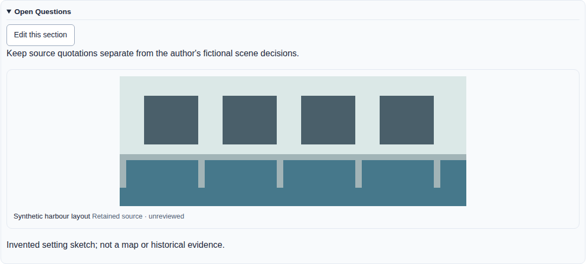

# Lixity

[](https://github.com/mfahsold/lixity/actions)


**Read the patterns in your writing. Keep the evidence behind your decisions.**

Lixity helps authors, editors and researchers see how a manuscript changes from
chapter to chapter. It measures sentence lengths, word use, dialogue and tense,
then lets you read the passages behind each result. Its research workspace keeps
source quotations and writing decisions connected. Your literary judgment guides
what you keep or revise.

Matthias Fahsold developed Lixity as an architect and developer at ROST Services
GmbH and used it while writing his own debut novel.

[Try the example](https://mfahsold.github.io/lixity/demo/report.html) ·
[Three-minute first look](https://mfahsold.github.io/lixity/guides/first-look.html) ·
[Installation](#installation) · [What you can do](#what-you-can-do) ·
[Practical guides](https://mfahsold.github.io/lixity/#guides) ·
[v2.3.0 release notes](docs/releases/v2.3.0.md)

The example is a read-only report made from invented text. It needs no
installation or manuscript upload.

Free for projects with no commercial purpose. A book intended for sale,
including self-publishing, requires a separate written commercial license.
[License details](#license).

## Installation

Lixity runs on Windows, macOS and Linux. It needs Python 3.10 or later.
The commands below run in a terminal and use [uv](https://docs.astral.sh/uv/) and Git.
For help installing these tools, or to use pipx instead, follow the
[installation guide](docs/INSTALLATION.md).

```bash
uv tool install --python 3.12 "git+https://github.com/mfahsold/lixity.git@v2.3.0"
lixity --version
```

This installs the released version. For later upgrades, select the new tag using
the [update instructions](docs/INSTALLATION.md#updates-and-removal), then restart
the local workspace. [Release notes](docs/releases/v2.3.0.md) describe compatibility
and known limits; the [changelog](CHANGELOG.md) records subsequent work on `main`.

**In 2.3.0:** explore the public example before installing. Attach local image
references to dossiers from the CLI through the same guarded workflow as the app.
See the [image workflow](docs/research/USAGE.md#keep-a-visual-reference-in-a-dossier).

**In 2.3.0:** opened paragraphs put the manuscript text first,
with measurements in a compact **Values** disclosure (**Werte** in German).
Chapter comparisons, reference bands, dimensions and structural diagnostics share
one tabbed style area. Closed paragraph contents are created when opened;
manuscript search still covers the complete text and exported reports work offline.

## Quick Start

Prepare a UTF-8 Markdown file with `## Chapter title` headings, then run:

```bash
lixity build manuscript.md --language de
```

Open `exports/manuscript_dashboard.html` in your browser. This report works
offline. Use `--language en` for English, or select another
[supported language](#supported-languages). English applies when no language is
selected; automatic detection requires `--language auto`.

GitHub Pages contains the documentation. For project management, research
editing and live settings on your computer, start the local workspace:

```bash
lixity serve --no-project --port 8765
```

Open `http://127.0.0.1:8765/`. **Open Project** reconnects an existing folder and
its research archive. **Import Manuscript** previews a selected file and creates
a new project when you confirm. The [first-project guide](docs/ONBOARDING.md)
walks through both choices.

Begin with the manuscript overview, then open a chapter that interests you.
The welcome guidance takes you from selecting a manuscript to confirming its
language and reading a passage. **Start your review** offers direct routes to
source text, chapter comparison and sentence rhythm; its selected passage is a
starting point for reading, not a quality ranking.
Hover over, focus or tap a dotted-underlined measurement label for its explanation.
Read the passage before changing prose or adjusting comparison settings.

## What you can do

### Understand your writing

See how sentence lengths, vocabulary, dialogue and tense vary throughout your
manuscript. Open the passages behind a result before deciding whether to revise.
Short or empty texts cannot support every comparison; unavailable results are
shown explicitly.

<a href="docs/screenshots/dashboard-light.png"></a>

[Read the language signals](https://mfahsold.github.io/lixity/guides/interpretation.html) ·
[Mobile view](docs/screenshots/dashboard-mobile.png) ·
[Dark theme](docs/screenshots/dashboard-dark.png)

### Compare chapters in context

The chapter map uses your manuscript's chapters as its reference. For example,
a chapter with longer sentences than usual may reflect a new voice or a formal
report. Select a coloured cell to inspect that chapter. The style axes bring
together related measurements, helping you see which chapters share patterns
and which features distinguish them.

<a href="docs/screenshots/dashboard-heatmap.png"></a>

[Understand chapter comparisons](https://mfahsold.github.io/lixity/guides/interpretation.html#consistency) ·
[Style dimensions](docs/screenshots/dashboard-dimensions.png) ·
[Reference bands](docs/screenshots/dashboard-reference.png)

Assign scenes to registers—such as dialogue, action or a formal report—so you can
compare scenes with a similar purpose. Each group has its own middle values
(medians); you can also set optional targets. Small samples may leave measurements
unavailable. [Scene example](docs/screenshots/dashboard-scenes.png) ·
[Setup and limits](docs/USAGE.md#scene-registers-and-project-targets).

### Print what the analysis found

`lixity pdf` composes a PDF from the manuscript and its measurements: an A4
analysis report, an A5 reading layout, or a submission sheet of 30 lines of 60
characters. Fonts are embedded as subsets, with searchable text for Unicode
characters covered by the selected fonts. No converter, no upload, no added
runtime dependency. These are reading and review layouts; PDF/X production
preflight and automatic fallback between fonts are not provided.

[Command reference](docs/USAGE.md#lixity-pdf)

### Keep review notes beside the text

Inspect paragraphs with their source lines, dialogue and tense labels. Work
markers keep review notes next to the relevant passage in Markdown. Their
visibility in a book export depends on the editor or converter you use.

<a href="docs/screenshots/dashboard-markers.png"></a>

[Work-marker instructions](docs/USAGE.md#work-markers-editor-visible) ·
[Paragraph view](docs/screenshots/dashboard-layer.png)

### Connect sources, claims and decisions

The experimental research workspace keeps selected sources, quotations and notes
in a separate local archive. A dossier gathers notes on a topic; a claim records
an assertion you can link to source passages; a decision explains what you chose
for the book. Filter by title or tag, or search the saved text. A saved quotation
records what a source says; its accuracy still needs review.

<a href="docs/screenshots/dashboard-dossier-image.png"></a>

Bring sources from local files or the optional Zotero Desktop bridge. PDF scans
can use locally installed Tesseract or a configured OCR worker. Import warnings
explain when extraction is incomplete or a requested fallback was used.

**Review** shows the records explicitly linked to a decision and whether those
links refer to an older version. You can inspect the earlier and current versions
before deciding to update a link. Related dossier edits can be previewed and saved
together; if another edit conflicts, the preview helps you resolve it while
preserving your draft.

Add a local PNG/JPEG to a dossier with a description and optional source note.
Earlier dossier versions keep their original image; no remote picture is fetched
and images receive no text scores. **Edit section**, **Add claim** and **Add
decision** keep a large topic manageable without copying whole documents or IDs.

[Research guide](https://mfahsold.github.io/lixity/guides/research-pdf.html) ·
[Search and citations](docs/screenshots/dashboard-research-search.png) ·
[Sources](docs/screenshots/dashboard-research-sources.png) ·
[Claims](docs/screenshots/dashboard-research-claims.png) ·
[Decisions](docs/screenshots/dashboard-research-decisions.png) ·
[Decision review](docs/screenshots/dashboard-research-review.png) ·
[Related revision preview](docs/screenshots/dashboard-research-change-set.png)

### Choose a project and its settings

Project actions remain available from each workspace view. Preview a manuscript
before importing it, select its analysis language, and adjust which differences
you want to examine. The NDA form has just name, optional
address, project name, date and place. Preview the friendly agreement and
download a PDF or editable text in the project language. Review it before signing.
Set **Author name** under **Project → Settings** to fill the project representative's name.

<a href="docs/screenshots/dashboard-project-settings.png"></a>

[Project workflow](docs/USAGE.md#dashboard-workflow) ·
[Import preview](docs/screenshots/dashboard-project-import.png) ·
[Mobile settings](docs/screenshots/dashboard-project-settings-mobile.png)

### Read a report in the terminal

Use `lixity analyze manuscript.md --language de` for a readable report, or add
`--json` for software integration. Chapter, paragraph, dialogue, pacing and
research commands are covered in the [command reference](docs/USAGE.md).

<a href="docs/screenshots/cli-analyze.png"></a>

These screenshots use public-domain literature or synthetic project records.
[More views and capture details](docs/screenshots/README.md).

## How to read the results

Each measurement answers a specific question about the text:

| Measurement | What it helps you notice |
| :--- | :--- |
| Sentence length and variation | Whether sentences stay similar in length or alternate between short and long. Suspense also depends on what happens in them. |
| Vocabulary diversity | How much words repeat. Compare passages of similar length, language and purpose. |
| Dialogue share | How much text falls inside recognized quotation marks. A high value may be expected in a conversation scene. |
| Chapter differences and consistency | How closely measurable chapters follow the book's observed patterns. A deliberate change in voice can lower consistency. |

Chapter comparisons use the manuscript's middle values and typical spread
(median and MAD), with an adjustment for estimated sampling noise. Colours mark
the direction of a difference, not its literary value. Optional statistical
checks mark a selection for review; they cannot certify that a passage needs editing.
An unavailable value can mean there is too little text or too few comparable
chapters to calculate it.

The mathematical core includes several vocabulary measures (HD-D, MTLD, MATTR,
Guiraud R, Maas a² and Yule's K). They answer related questions using different
models and sample sizes. Readability and grammatical-pattern indicators have
language-specific limits. Formulas, citations and worked examples live in
[Methods](docs/METHODS.md).
The [interpretation guide](https://mfahsold.github.io/lixity/guides/interpretation.html)
explains how to read results; [stability and validation limits](docs/STABILITY.md)
describe what has and has not been established.

## Supported Languages

German (`de`) and English (`en`) have the most extensive linguistic resources and
language-specific fixtures. French (`fr`), Spanish (`es`), Italian (`it`),
Portuguese (`pt`) and Dutch (`nl`) also have localized interfaces and analysis
resources, with narrower heuristic coverage and validation.

Choose the manuscript language explicitly. `LIXITY_LANG=de` selects German
terminal messages independently of `--language de`, which selects German
analysis. Documentation is English; source quotations retain their original
language. Mathematical identifiers and numeric JSON values are language-neutral.

[Language support and limits](docs/LOCALIZATION.md).

## Python API and automation

```python
from lixity import api

html = api.dashboard(text, language="de", project_config={})
```

CLI, Python and dashboard analysis share one pipeline. Analysis/profile JSON uses
schema **v2**; style JSON uses **v4**. Integrations should pass explicit project
settings when working with several projects.

Choose `api.analyze` for numeric results or `api.fingerprint` for a style
reference. Each convenience call performs its own analysis; integrations needing
several outputs can [reuse the shared analysis result](docs/ARCHITECTURE.md#configuration-and-multiple-projects).

[Interface contracts](docs/AGENTS.md) · [Architecture](docs/ARCHITECTURE.md) ·
[Research commands](docs/research/USAGE.md) · [Automation summary](docs/llms.txt)

## License

Lixity is **source-available, not Open Source**. LNCL-1.0 permits use only for
projects with no commercial purpose. Private writing, research and education
are not blanket exemptions for commercial projects.

Books intended for sale, including self-publishing, ebooks and print-on-demand,
paid editing, client work and commercial integrations require a separate written
commercial license **before use for that project**. If publication plans change,
contact the maintainer before commercial use or sale.

[Licensing guide](docs/LICENSING.md) · [Full terms](LICENSE) ·
[Commercial enquiries](mailto:mfahsold@googlemail.com?subject=Lixity%20Commercial%20Inquiry)

Maintainer: Matthias Fahsold, Hamburg, Germany. Project operator:
ROST Services GmbH, Rümpel, Germany. [Legal notice](https://mfahsold.github.io/lixity/#impressum).

[Contributing](CONTRIBUTING.md) · [Report a security concern](SECURITY.md) ·
[Sample-text provenance](samples/README.md)
