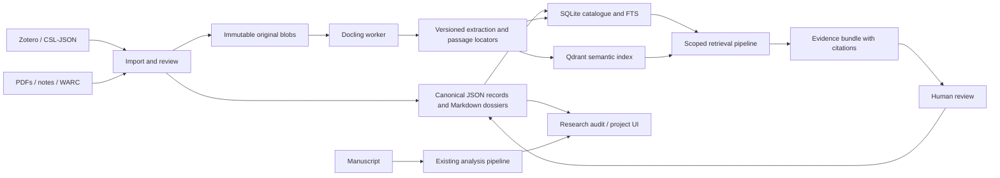
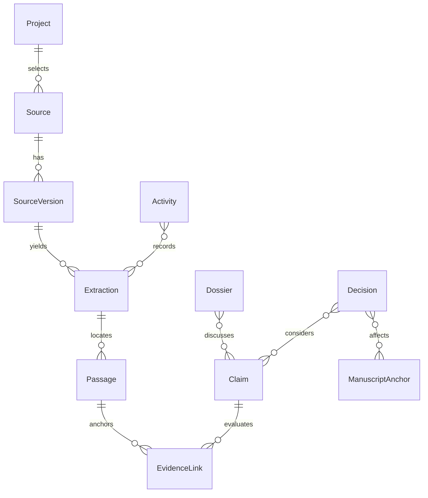

# RFC: an evidence-based research workspace for Lixity

Status: **target architecture**, 2026-09-25. An initial [local UTF-8 research pilot](USAGE.md)
is in local development towards `1.16.0.dev0`; it is unreleased and **not in release `v1.15.0`**.
The remaining modules, providers and schemas below are proposed, not available.
See the [implementation scope](IMPLEMENTATION.md) for the first slice. No new
runtime dependencies are introduced by that slice.

Companion documents: [research and platform evidence](EVIDENCE.md),
[data model and interchange example](DATA_MODEL.md).

## 1. Problem and intended outcome

An author researching a multilingual, historically grounded work needs to retain
original material, distinguish evidence from interpretation, maintain dossiers,
and find the exact passage behind a statement months later. Sources change,
OCR improves, names have aliases, and fictional decisions are revised. A folder
of summaries or an embedding database alone cannot represent those changes.

The proposed research workspace connects collection, cataloguing, annotation,
claims, dossiers, decisions and manuscript references. It uses existing
platforms for bibliography, extraction, search and preservation. Lixity owns the
author-specific evidence model and review workflow. Authors can use Markdown
editors such as Obsidian, a CLI, or a project adapter against the same records.

The motivating requirements are generalized: independent narrative strands may
share a setting without sharing chronology or causality; historical records and
present-day descriptions must be distinguishable; a language-development dossier
needs population and age context rather than automatic prose rules. Examples in
this RFC are synthetic. No unpublished manuscript, plot, source collection or
private project identifier is included.

Success means that an author can import a source, archive a permitted copy,
cite an immutable passage, record conflicting interpretations, and update a
dossier without losing the previous evidence trail. Search must expose that
trail and report missing evidence. It must not silently make story decisions.

## 2. Existing architecture and constraints

Inspected baseline: commit `355d51c215a78b3491031f3d9a6feaa8a3c60087`, Lixity
1.15.0. See [existing architecture](../ARCHITECTURE.md).

| Current surface | Relevance and required boundary |
| --- | --- |
| `src/lixity/pipeline.py`: `DocumentAnalysis`, `analyze_document` | Deterministic manuscript analysis. Research must not add fetching, embedding or model inference to this path. |
| `src/lixity/api.py`, `src/lixity/cli.py` | Stable analysis interfaces. Add a separate research namespace; preserve analyze/profile v2 and style v4. |
| `src/lixity/models.py`: `DossierStatus`, `CorpusAuditReport` | Existing synchronization summaries, not a source/claim database. Preserve their shapes and meaning; introduce richer research audit output separately. |
| `src/lixity/config.py`: `TOOL_KEYS`, `_load_toml` | Unknown settings are filtered out; TOML reading is unavailable on Python 3.10. A proposed research configuration needs its own explicit loader, not an assumed existing setting. |
| `src/lixity/workspace.py` | Builds and rotates analysis outputs. Its bounded output archive is not an evidence-preservation repository. |
| `src/lixity/io.py`: `FileUtils.atomic_write_if_changed` | Has fallback paths that do not guarantee transactional immutable storage. A research repository needs a separately specified durable commit protocol. |
| `src/lixity/ui/`, `src/lixity/language_data.py` | Reuse presentation components and localized labels. The static dashboard remains usable without a research service. |

The analysis core remains offline, Python 3.10+, with its current dependency
policy. Research providers may need a newer Python environment, downloaded
models, native libraries or network access. These must be optional and isolated.
The repository's LNCL-1.0 licensing is unchanged; its current description is
source-available. Third-party software and model weights retain their own
licenses. Obsidian is an optional client, not a required open-source dependency.

## 3. Recommended stack and alternatives

Choose a **portable evidence repository plus optional research runtime**.
Hybrid retrieval belongs in the design from the start, while the minimum
installation remains useful without an embedding model. Optionality is a
deployment boundary, not postponement of the data model.

| Responsibility | Selected component/format | Why and boundary |
| --- | --- | --- |
| Bibliography and reading | Zotero native JSON plus CSL-JSON import/export | Reuse a literature manager. Preserve Zotero library/item identity and version, rather than scraping its internal database. Initial connector is read-only. |
| Author-controlled records | Versioned JSON + Markdown; JSON Schema 2020-12 | Typed entities and human-editable dossiers, portable through Git. Standard Markdown links remain sufficient; Obsidian-specific views are optional. |
| Local catalogue and exact search | SQLite + FTS5 | Transactions, filters and lexical search without a daemon. A rebuildable projection, never the only copy of an accepted claim. Detect FTS5 availability explicitly. |
| PDF and structured-document extraction | Docling in an isolated worker | Preserve document structure, tables, pages and provenance in Docling JSON. Markdown is a reading derivative. OCR/model assets are explicitly installed and versioned. |
| Semantic and hybrid retrieval | Qdrant | Named dense/sparse vectors, filters and rank fusion. Local client mode for a bounded single-process pilot; a server for shared access and operational scale. Validate backend capabilities rather than assuming parity. |
| Embeddings and reranking | Local model provider; BGE-M3 as an initial multilingual candidate | Compare German/Italian/English retrieval on the project benchmark. Pin model revision, tokenizer, normalization and dimensions. No claim that this model is universally best. |
| Pipeline composition | Haystack adapter in the optional runtime | Reuse document stores, retrievers, routing and pipeline composition. Lixity IDs and evidence contracts must not depend on a Haystack `Document` layout or installed major version. |
| Original files | SHA-256 addressed filesystem; optional S3-compatible backend | Preserve bytes independently of URLs, Zotero attachment locations and vector stores. Keep credentials and backend-specific URLs outside canonical records. |
| Web capture | Import WARC/WACZ from an established capture tool such as Browsertrix | Preserve captured responses and provenance; a cleaned HTML page is not a complete web archive. Capture may be incomplete and must say so. |
| Annotation and lineage interchange | W3C Web Annotation selectors; PROV-O mappings | Cite a representation and passage, and describe the process producing derivatives. No RDF database required. |
| Portable archival export | RO-Crate profile | Bundle permitted objects, metadata, relations and checksums. Declare the exact profile/specification version; validate before claiming conformance. |

Platform references and evidence limitations are in [EVIDENCE.md](EVIDENCE.md).
This RFC selects component families, not untested package pins. The provider
implementation must produce a tested lockfile and model manifest for each
supported deployment. Provider upgrades are independent of analysis releases.

**Why keep SQLite FTS5 and Qdrant?** SQLite supplies an offline lexical baseline,
structured catalogue and exact filters. The reference hybrid path fuses SQLite
lexical candidates with Qdrant dense candidates by passage ID. A server profile
may use Qdrant sparse+dense fusion instead, with its own benchmark and explicitly
recorded retrieval profile. Never combine both lexical paths accidentally or
treat their scores as interchangeable. The policy is one lexical route per query.

**Alternative A: Zotero + Obsidian plugins only.** Low setup cost and useful for
reading, but no shared Lixity contract for immutable passage identity, provenance,
superseded assertions or reproducible cross-provider retrieval. Support these
tools as clients, not as the complete research model.

**Alternative B: PostgreSQL/pgvector + object store + web application as the
mandatory platform.** Attractive for transactional concurrent editing and
centralized access control. It would impose a server and deployment lifecycle
on today's small offline CLI. Keep this as a separate future team product
decision, not a second canonical database silently synchronized with files.

**Alternative C: a general document-chat product as the system of record.**
Open WebUI, for example, already supports document search, hybrid retrieval and
citations. It can be a consumer of a future Lixity evidence API, but chat history
and retrieved fragments do not replace author-reviewed claims or source retention.
Avoid maintaining a second independently curated copy of research in that UI.

## 4. Deployment profiles

### Portable profile

Lixity's core remains unchanged. A future `lixity.research` module provides
schemas, validation, explicit project resolution, Markdown/JSON imports and
SQLite catalogue/FTS search. Existing analysis commands do not import providers.
Research commands must also work before a manuscript has any content.

The optional research extra adds a safe YAML parser for Obsidian-compatible
dossier frontmatter (proposed: PyYAML with safe loading and schema validation).
This is an explicit dependency decision for research, not a new analysis-core
dependency. Accept only JSON-compatible mappings/scalars/lists; reject aliases,
custom tags, multiple documents and oversized metadata before model validation.

The project may be edited in Obsidian or another editor. Zotero may run separately
or supply a CSL-JSON export. No account, server or GPU is required for catalogue,
dossiers, citation validation or lexical search.

### Local research runtime

A separately installed worker environment (reference target Python 3.12) runs
Docling, model inference, Qdrant client and Haystack integration. Communicate via
a versioned job/result JSON protocol over subprocess stdin/stdout; use file/blob
references instead of shell-interpolated arguments. Provider logs use stderr.
The runtime can be replaced by a service without changing canonical entities.

Install/model download is explicit; after assets are provisioned, local processing
can run offline. A configured remote embedding or generation endpoint is a
separate capability, with the selected project's allowed data destinations.
Generation is not required to ingest, search or cite. Hardware suitability and
memory use of multilingual models must be measured before choosing defaults.

### Shared research runtime

Run a Qdrant server and extraction/inference workers behind an authenticated
project adapter; original blobs may use an S3-compatible store. Keep the initial
authoring model as one acceptance authority per project with Git review/merge for
asynchronous draft collaboration. Contributors merge working-copy edits before
that authority allocates accepted revision numbers. Immutable accepted revision
files are never textually merged or replaced; a revision/hash collision rejects
the import. Independent offline acceptance across checkouts is outside this first
protocol. A single process owns each writable local catalogue.
Do not put SQLite or Qdrant local storage on a shared network drive.

This profile shares processing and retrieval, not realtime collaborative editing.
Concurrent authoring would need a dedicated transaction authority, conflict
protocol and permissions design. Zotero group-library permissions do not grant
access to manuscript notes, and knowing a `project_id` is not authorization.



## 5. Model: source, evidence, interpretation and fiction

The detailed field contract and a complete synthetic evidence chain are in
[DATA_MODEL.md](DATA_MODEL.md). Fundamental relationships:



`Source` identifies a bibliographic or archival item. `SourceVersion` records a
particular manifestation or capture, with checksum, date and access conditions.
`Extraction` identifies a parser/OCR run against that version. `Passage` binds
text and selectors to that extraction. These are distinct: corrected OCR does
not change the original source bytes, but it does change passage offsets.

`Claim` is an authored assertion with scoped time/place and review state.
`EvidenceLink` gives a passage's relationship to the claim: supports,
contradicts, qualifies or contextualizes. A link records the reviewer's rationale;
semantic similarity cannot create a reviewed support link by itself.
`Decision` records a fictional choice independently of whether it matches
historical evidence. A novel may deliberately depart from a fact and document
that choice. `Dossier` assembles these records without becoming their duplicate.

Unknown dates are unknown, not the retrieval date. Retain date precision and
uncertainty; distinguish publication date, capture date, depicted period and
review date. Aliases identify entities, but ambiguous names do not auto-merge
places or people. Narrative strand is an explicit filter and is separate from
historical chronology, scene order and thematic similarity.

## 6. Canonical storage and durable updates

Proposed layout, separate from today's `exports/`:

```text
research/
  project.json                  # version, project ID and relative paths
  HEAD.json                     # atomic pointer to a completed manifest
  manifests/<generation>.json   # completed snapshots; pin every entity revision
  revisions/<kind>/<id>/<rev>    # immutable accepted record/dossier revisions
  sources/<id>.json              # bibliographic identity and external mapping
  versions/<id>.json             # immutable capture manifests
  extractions/<id>.json          # extraction provenance and blob references
  passages/<id>.json             # stable evidence locators
  claims/<id>.json
  evidence/<id>.json
  decisions/<id>.json
  dossiers/<id>.md               # dossier metadata + authored narrative
  activities/<id>.json           # import/review/transform/purge records
  tombstones/<id>.json
  evaluations/                  # synthetic queries and judgments
.lixity/research/                # ignored catalogue, indexes, locks, job state
<configured-archive-root>/       # content-addressed original/derived blobs
```

Each authoritative fact has one owner. JSON records own claim/evidence metadata;
dossier frontmatter owns only dossier metadata and references. Obsidian tags and
tables are views, not a second writable database of claim status. Imported Zotero
fields are refreshed by its connector; local evaluations use separate fields.
CSL-JSON is a transport, not a lossless substitute for all Zotero metadata.

The named entity files and dossier Markdown are editable working copies. A
completed manifest is the authority for accepted state: it pins immutable copies
under `revisions/` with their hashes. Search and export read that snapshot, not a
half-edited directory. Working copies are authoring views of those same entities,
not independently authoritative duplicates. An explicit `working` view may show
pending edits, labeled as such. `HEAD.json` points to the last committed manifest;
it is not a versioned domain entity and is excluded from manifest entity hashes.
The Project entity contains stable configuration, not its own manifest pointer.
Preserve referenced revisions even when Git history is unavailable.

Use stable UUID identities, independent of filenames and titles, plus integer
record revisions and an expected-content-hash for optimistic concurrency.
Provider item keys and citekeys are mappings, not universal identifiers.

Writes use a per-project lock, stage immutable revisions on the same filesystem,
validate references, fsync files/directories as supported, and publish a complete
manifest by atomic rename. While holding the lock, compare the expected previous
head and atomically replace `HEAD.json`; this is the commit point. Readers pin
one head value per operation. Recovery never selects the newest file by timestamp:
an unreachable staged manifest is uncommitted and can be inspected or reclaimed;
a committed head is replayed to rebuild projections and working copies. A failed
head precondition produces a conflict, not an overwrite. CAS writes verify checksum before publication and
refuse differing bytes at an existing digest path. An implementation must test
crash recovery; it must not inherit stronger guarantees from a helper's name.

External Markdown edits enter through a reconciliation pass. Compare the last
imported hash, validate metadata, then create a new revision. Never overwrite
concurrent dossier edits with generated prose. Unresolved Git conflict markers
block ingestion and index refresh for the affected records.

An ingestion activity records queued/running/succeeded/failed/cancelled state,
inputs and provider configuration. Queue leases are operational state; accepted
records and terminal provenance must survive rebuilding the queue/catalogue.
Retries are idempotent on project, input checksum and conversion configuration.

## 7. Ingestion, refresh and deletion

1. **Select:** explicit project and source collection/file scope. Discover format,
   size, permission and provider requirements before fetching or parsing.
2. **Capture:** archive permitted bytes and response/capture metadata; otherwise
   store a metadata-only version marked unavailable for extraction.
3. **Extract:** isolate parsers; retain Docling JSON, page labels, table structure,
   OCR configuration and extraction warnings. Reading Markdown is a derivative.
4. **Annotate:** preserve source-language excerpts; translations are derived
   annotations carrying translator/model provenance, not original quotations.
5. **Review:** accept or reject claim/evidence suggestions. No import can accept
   an author decision or silently rewrite an established claim.
6. **Project:** update catalogue and retrieval indexes for the accepted snapshot.
7. **Refresh:** a new source capture produces a new version, then an impact list
   of affected passages, claims, dossiers and manuscript references. Previous
   citations continue to resolve. New evidence does not automatically supersede
   old historical evidence.

For Zotero, persist sync cursors scoped by API origin/server identity and library.
Use documented version/deletion APIs, conditional requests and backoff. Local
and Web API version counters must not be compared. Deleted items create a local
tombstone and a review task; they do not authorize deleting cited archives.
An unavailable source is different from an invalidated claim.

**Withdrawal and purge are different operations.** Withdrawal hides a source from
default search but preserves cited history. An explicit purge removes selected
blobs, excerpts, embeddings, generated derivatives and caches, with a content-free
audit record. Report copies outside the current repository and retention systems
that cannot be erased automatically. Git history and object-store versioning need
their own purge procedure; do not promise that deleting a row erases all copies.

Purge is an explicit exception to immutable retention. Its preview traverses
retained record/dossier revisions and quoted excerpts as well as blobs and caches.
Replace erased revision entries with content-free tombstones; historic manifests
retain their original expected hashes and resolve those entries as intentionally
unavailable. They must not claim the original snapshot remains fully reproducible.
Default blob namespaces are project-local. Before removing any shared digest,
check references outside the authorized purge scope and report retained copies;
never destroy another project's source because its bytes happen to match.

Backups include HEAD, manifests, all pinned record/dossier revisions, original
blobs and retained cited extraction/representation bytes, not just vectors.
Re-running OCR cannot reconstruct an old citation's exact offsets reliably.
Restore verification checks hashes and references and then rebuilds indexes. `exports/`
rotation must never delete the research archive.

## 8. Retrieval and evidence-bound generation

Expose three explicit modes:

- **Evidence:** exact IDs/aliases, metadata filters and lexical+dense candidates,
  deduplication, rank fusion and optional reranking. Return original passages.
- **Explore:** related entities and broader dossiers; inferred links are proposals.
  Canonical relationship records are projected into SQLite for traversal; a graph
  database is not required.
- **Read:** return a selected complete source section or small dossier. Long
  context is useful when bounded; do not force every question through chunk search.

The service applies project authorization, allowed source types, narrative strand,
time scope and visibility before either search branch. Recheck them against
canonical records before releasing results. A caller cannot relax access filters.
Historical/as-of queries specify both the source snapshot and the described period.

Structure-aware passages preserve heading context, tables and page references.
Token windows are model-specific implementation settings. Late chunking is an
evaluated provider option, not a prerequisite for stable citations. The immutable
passage is the evidence target; an indexing chunk may include parent context or
several passages, and must map back to all contributing passage IDs.

Each index generation records project snapshot, model revision, tokenizer,
dimensions, distance metric, extractor/chunker configuration and fusion profile.
Use generation-specific namespaces, build and validate a new generation, then
switch the project pointer. Never query mixed embedding spaces. Tombstones take
effect immediately at the canonical result filter, even while physical index
deletion is pending. If the index is stale, say so and use a current lexical
fallback or fail explicitly; never label partial retrieval complete.

Optional answer generation consumes an evidence bundle, with statement-to-passage
references, unsupported questions and source limitations. Generated synthesis
is a draft artifact with model/prompt/run provenance, not an accepted claim.
Citations must resolve to exact archived representations; an automated entailment
check alone cannot prove historical truth or model faithfulness.
Reports may include conflicting sources without forcing a single answer.

## 9. Lixity integration plan

The following are proposed names, not current public interfaces:

| Change area | Proposed extension |
| --- | --- |
| `src/lixity/research/models.py` | Pydantic research entities and exported JSON schemas, separately versioned from analysis results. |
| `src/lixity/research/repository.py` | Explicit project root, validation, transactions, revisions and blob-store protocol. No cwd-based project switching in library calls. |
| `src/lixity/research/catalogue.py` | SQLite migrations/projections, FTS search and dependency traversal. |
| `src/lixity/research/api.py` | `validate`, `search`, `resolve_citation`, `audit`, import/export contracts. Provider-neutral results. |
| `src/lixity/research/cli.py` | Lazily registered `lixity research` commands, clean JSON stdout and established exit codes. |
| Optional runtime/distribution | Zotero, Docling, Qdrant, Haystack and model adapters; no imports from the core analysis pipeline. |
| Project server adapter | Authorizes mutation and remote jobs; displays import/review/drift state using shared UI components. |
| Existing `DossierStatus` | Keep legacy synchronization status intact. New research audit distinguishes missing evidence, unresolved conflict, stale citation and outdated index. |

Proposed command sketch, **not runnable in 1.15.0**:

```bash
lixity research init --project ./example
lixity research import --project ./example --csl-json bibliography.json --dry-run
lixity research ingest --project ./example --file source.pdf
lixity research search --project ./example --mode evidence --query 'historical name'
lixity research cite --project ./example --passage <id> --json
lixity research audit --project ./example --json
lixity research export --project ./example --format ro-crate --metadata-only
```

Use `research/project.json` as a Python-3.10-readable manifest. UI/provider
preferences may use a new, separately parsed configuration with documented
precedence: explicit API/CLI arguments > explicit project settings > code defaults.
Credentials belong in environment/keyring/service secrets. Normal `lixity build`
never fetches, synchronizes, installs models or mutates research. An explicitly
requested research status panel may consume a local audit result.

Manuscript links use stable explicit anchors where available, a manuscript
revision/checksum and a quote selector. Source line numbers are display hints;
edits can move them. An audit reports ambiguous/orphaned anchors for review.
Generic `pruefen` markers may link to a claim, but existing marker semantics and
parser behavior must remain compatible.

## 10. Trust and resource boundaries

Imported text is data, including embedded instructions. Fetchers restrict schemes,
redirects, internal network targets and size; parsers have time/memory limits and
no ambient secrets. Archive extraction rejects traversal paths. HTML previews are
sanitized and scripts disabled. Optional online providers receive only approved
project scopes; private full text must not appear in public logs or test fixtures.

Remote workers enforce authorization independently of Qdrant payload filters.
Limit batch size, model context, job duration and concurrent work. A corrupt PDF,
OCR failure, provider timeout or missing model yields an explicit partial/failed
record, never an empty successful source. Downloading model weights and sending
documents to a remote model are distinct capabilities.

Archive records carry access/redistribution conditions and sensitive-data labels.
An archive permission is not a publication permission. Export profiles default to
metadata and selected authored notes; including source bytes or excerpts requires
an explicit permitted selection. Local content-addressed storage prevents accidental
replacement, not malicious tampering; stronger retention is backend-specific.

## 11. Evaluation and implementation sequence

Create a public synthetic/public-domain fixture set, separate from private author
projects. Start with 30–50 reviewed questions covering exact identifiers, multilingual
aliases, paraphrases, historical validity, contradictory evidence, unanswered
questions, two unrelated narrative strands, and source refresh/deletion. These
counts are planning targets, not statistically established thresholds.

Compare lexical-only, dense-only, hybrid, hybrid+reranker and bounded full-context
reading using the same source snapshot and relevance judgments. Report passage
Recall@k/MRR, citation resolution, answer support/coverage, abstention, p50/p95
latency, peak memory and model/network cost. Human-check a sample of any automated
judge output. Keep author-reviewed claims out of the source evidence baseline when
they contain the test answer. Record model/prompt/corpus versions with results.

Mandatory correctness gates: no cross-project disclosure; accepted citations resolve
to unchanged bytes or explicitly unavailable material; no draft becomes an accepted
decision; deleted/withdrawn records do not leak into default results; rebuilding
indexes preserves canonical content. Retrieval quality targets are set against the
measured lexical baseline, not invented universal accuracy percentages.

| Increment | Deliverable | Exit evidence |
| --- | --- | --- |
| 1. Contracts and portable repository | Entity/schema implementation, revision protocol, synthetic round-trip fixture, catalogue/FTS, migration dry-run | Reference and schema validation; concurrency/crash-recovery tests; existing core checks unchanged |
| 2. Sources and archives | Read-only Zotero/CSL importer, content-addressed blobs, WARC import, capture/version UI | Duplicate/idempotency tests; deletion and restore exercises; metadata-only export |
| 3. Extraction and annotation | Docling worker, OCR diagnostics, immutable passage selectors | Page/table/quote fixtures; OCR upgrade without silently retargeting citations |
| 4. Search and evaluation | Qdrant + model provider + Haystack adapter; benchmark report | Measured lexical/dense/hybrid comparison; offline behavior and stale-index tests |
| 5. Dossier and manuscript workflow | Evidence review, decisions, citation/drift UI and localized labels | End-to-end synthetic author task; keyboard/mobile review; legacy JSON contract tests |
| 6. Shared runtime and archival export | Authorized service profile, object store adapter, validated RO-Crate export | Access isolation, backup/restore, resource limits and export permission checks |

Each increment is a separate implementation PR; phase 1 establishes the contracts
all adapters share. Existing dossiers migrate without inventing evidence: preserve
their original content, assign IDs and mark extracted assertions unreviewed.
Do not reclassify every sentence as a fact or rewrite authored prose on import.

Maintainer decisions before implementation: package/distribution boundary for the
worker; supported provider/version matrix; first multilingual model profile after
measurement; chosen RO-Crate profile; and whether shared processing is needed in
the first release. The recommendation is portable contracts first with a local
hybrid reference implementation, not a mandatory hosted service.
